# Screenshots

Commit `(local run)`, run `(local run)`, capture mode `none`.

Real Electron app with no map loaded: WORLDLENS_CAPTURE_MAP was not set, so this run had no rendered map to serve. The map area is the app's empty state, not a rendering failure. Nothing was fetched from any network.

## firstrun-1-welcome

First-run setup, the welcome step, with the three language modes and a separate funny level for each language. Real Electron app with no map loaded: WORLDLENS_CAPTURE_MAP was not set, so this run had no rendered map to serve. The map area is the app's empty state, not a rendering failure. Nothing was fetched from any network. This image is cropped to the first-run dialog rather than showing the whole window.

## firstrun-1-welcome-window

First-run setup as it appears over the whole application window on a fresh profile. Real Electron app with no map loaded: WORLDLENS_CAPTURE_MAP was not set, so this run had no rendered map to serve. The map area is the app's empty state, not a rendering failure. Nothing was fetched from any network. In this image, no map is loaded; the map area is the app's empty state.

## firstrun-2-eula

First-run setup, the Minecraft licence step, with the document provenance and its anchored search. Real Electron app with no map loaded: WORLDLENS_CAPTURE_MAP was not set, so this run had no rendered map to serve. The map area is the app's empty state, not a rendering failure. Nothing was fetched from any network. This image is cropped to the first-run dialog rather than showing the whole window.

## firstrun-2-consent

First-run setup, the Minecraft files step, which asks once whether the application may download from Mojang and says what each answer means. Real Electron app with no map loaded: WORLDLENS_CAPTURE_MAP was not set, so this run had no rendered map to serve. The map area is the app's empty state, not a rendering failure. Nothing was fetched from any network. This image is cropped to the first-run dialog rather than showing the whole window.

## firstrun-3-storage

First-run setup, the map storage step, which asks where rendered maps should be written. Real Electron app with no map loaded: WORLDLENS_CAPTURE_MAP was not set, so this run had no rendered map to serve. The map area is the app's empty state, not a rendering failure. Nothing was fetched from any network. This image is cropped to the first-run dialog rather than showing the whole window.

## run-location

The render-location choice: local, Docker on this computer, and another machine over SSH, with Docker's real daemon state and the route that will actually be used. Real Electron app with no map loaded: WORLDLENS_CAPTURE_MAP was not set, so this run had no rendered map to serve. The map area is the app's empty state, not a rendering failure. Nothing was fetched from any network. This image is cropped to the render-location card rather than showing the whole window.

## chrome-titlebar

The application's own Material title bar, the whole width of the window, with no operating system caption bar above it. Real Electron app with no map loaded: WORLDLENS_CAPTURE_MAP was not set, so this run had no rendered map to serve. The map area is the app's empty state, not a rendering failure. Nothing was fetched from any network. This image is cropped to the title bar rather than showing the whole window.

## chrome-titlebar-window-buttons

The minimize, maximize and close buttons the application draws for itself, because the window is frameless. Real Electron app with no map loaded: WORLDLENS_CAPTURE_MAP was not set, so this run had no rendered map to serve. The map area is the app's empty state, not a rendering failure. Nothing was fetched from any network. This image is cropped to the window buttons rather than showing the whole window.

## chrome-app-rail

The application rail: the three destinations - Home, Map and Work - each with its visible label, the Work badge counting open jobs, and a footer holding search, notifications and settings. Real Electron app with no map loaded: WORLDLENS_CAPTURE_MAP was not set, so this run had no rendered map to serve. The map area is the app's empty state, not a rendering failure. Nothing was fetched from any network. This image is cropped to the application rail rather than showing the whole window.

## dimsum-surprise

The dim sum startup surprise: a non-blocking, auto-dismissing corner snackbar naming one dish in both languages. Forced to win its draw by a screenshot-harness-only localStorage override that also supplies the dish, so the capture never has to reach the public dish catalog; production code never writes this key and draws the real one-in-ten chance every other launch. Real Electron app with no map loaded: WORLDLENS_CAPTURE_MAP was not set, so this run had no rendered map to serve. The map area is the app's empty state, not a rendering failure. Nothing was fetched from any network. In this image, an opaque surface fills the window, so none of the map behind it is visible.

## home-screen

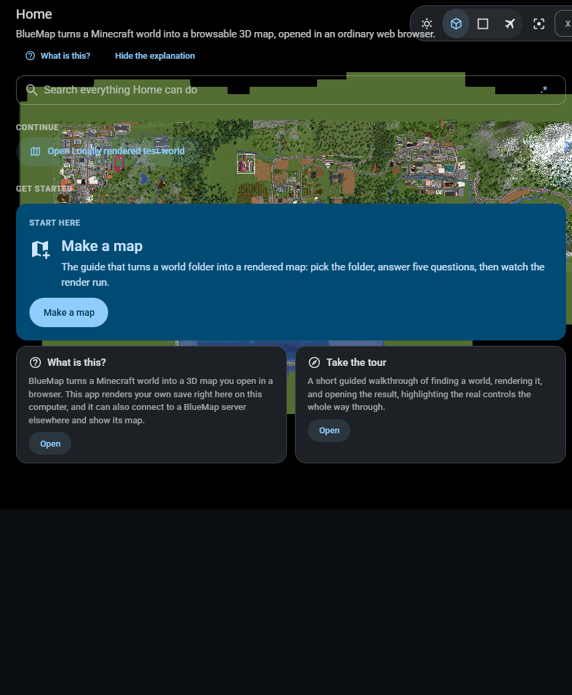

The landing screen the application opens on, above the catalogues: the weighted "what would you like to do" list, with its own search across everything Home can reach. Real Electron app with no map loaded: WORLDLENS_CAPTURE_MAP was not set, so this run had no rendered map to serve. The map area is the app's empty state, not a rendering failure. Nothing was fetched from any network. This image is cropped to the landing screen rather than showing the whole window.

## home-catalogues

Home, the destination the application opens on: five catalogues covering everything it can do, each card saying what that catalogue is for, with its own search across all of them. Real Electron app with no map loaded: WORLDLENS_CAPTURE_MAP was not set, so this run had no rendered map to serve. The map area is the app's empty state, not a rendering failure. Nothing was fetched from any network. In this image, an opaque surface fills the window, so none of the map behind it is visible.

## home-catalogue-page

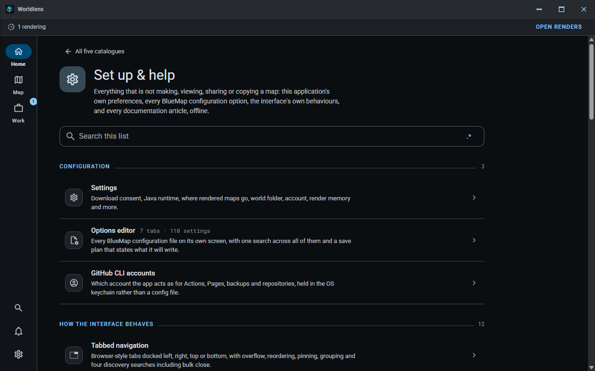

One catalogue opened from Home: every feature it holds as its own row with a blurb saying what it does, grouped under headings, and the search that reaches all of them. Real Electron app with no map loaded: WORLDLENS_CAPTURE_MAP was not set, so this run had no rendered map to serve. The map area is the app's empty state, not a rendering failure. Nothing was fetched from any network. In this image, an opaque surface fills the window, so none of the map behind it is visible.

## redesign-home-catalogues-360x800

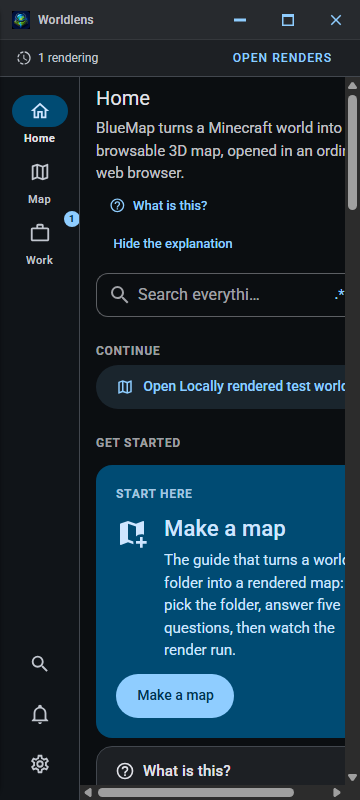

The redesigned Home catalogue shell at 360 by 800 CSS pixels: the persistent application rail, five-catalogue discovery surface, and anchored search field in their compact layout. Real Electron app with no map loaded: WORLDLENS_CAPTURE_MAP was not set, so this run had no rendered map to serve. The map area is the app's empty state, not a rendering failure. Nothing was fetched from any network. In this image, an opaque surface fills the window, so none of the map behind it is visible. Captured through Chromium's DevTools surface at the exact CSS viewport. The metrics sidecar records zero horizontal overflow, no clipped visible controls, and every primary compact target at least 44 by 44 CSS pixels.

## redesign-home-catalogue-page-360x800

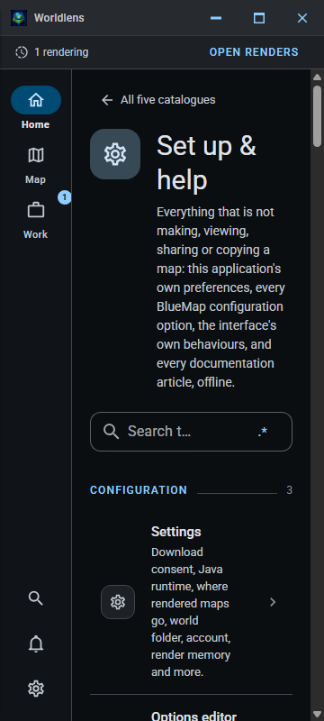

A redesigned Home catalogue at 360 by 800 CSS pixels: feature rows, their direct targets, the persistent application rail, and the catalogue's own search field without a horizontal escape route. Real Electron app with no map loaded: WORLDLENS_CAPTURE_MAP was not set, so this run had no rendered map to serve. The map area is the app's empty state, not a rendering failure. Nothing was fetched from any network. In this image, an opaque surface fills the window, so none of the map behind it is visible. Captured through Chromium's DevTools surface at the exact CSS viewport. The metrics sidecar records zero horizontal overflow, no clipped visible controls, and every primary compact target at least 44 by 44 CSS pixels.

## redesign-home-catalogues-390x844

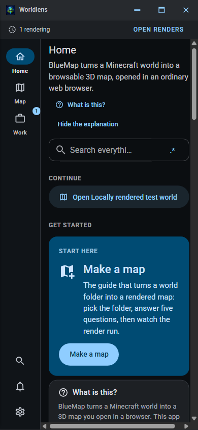

The redesigned Home catalogue shell at 390 by 844 CSS pixels: the persistent application rail, five-catalogue discovery surface, and anchored search field in their compact layout. Real Electron app with no map loaded: WORLDLENS_CAPTURE_MAP was not set, so this run had no rendered map to serve. The map area is the app's empty state, not a rendering failure. Nothing was fetched from any network. In this image, an opaque surface fills the window, so none of the map behind it is visible. Captured through Chromium's DevTools surface at the exact CSS viewport. The metrics sidecar records zero horizontal overflow, no clipped visible controls, and every primary compact target at least 44 by 44 CSS pixels.

## redesign-home-catalogue-page-390x844

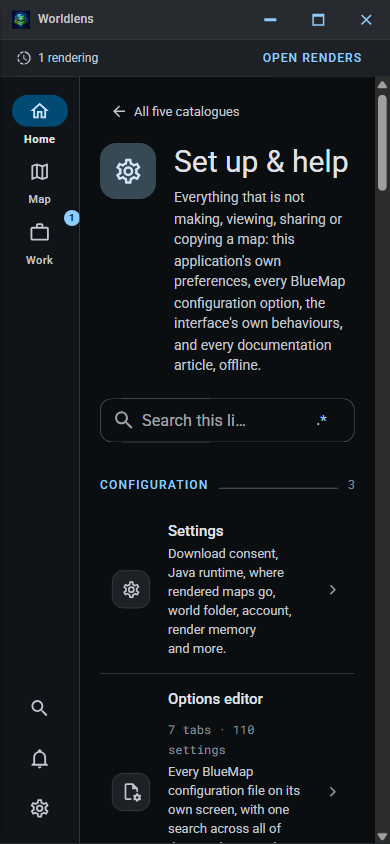

A redesigned Home catalogue at 390 by 844 CSS pixels: feature rows, their direct targets, the persistent application rail, and the catalogue's own search field without a horizontal escape route. Real Electron app with no map loaded: WORLDLENS_CAPTURE_MAP was not set, so this run had no rendered map to serve. The map area is the app's empty state, not a rendering failure. Nothing was fetched from any network. In this image, an opaque surface fills the window, so none of the map behind it is visible. Captured through Chromium's DevTools surface at the exact CSS viewport. The metrics sidecar records zero horizontal overflow, no clipped visible controls, and every primary compact target at least 44 by 44 CSS pixels.

## redesign-home-catalogues-414x896

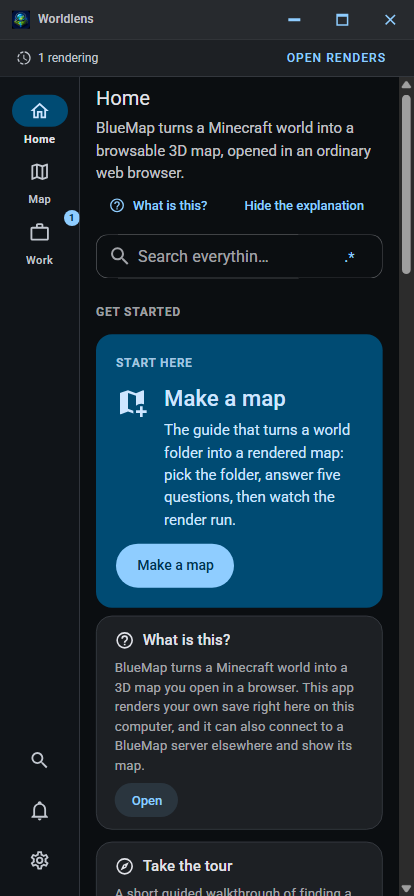

The redesigned Home catalogue shell at 414 by 896 CSS pixels: the persistent application rail, five-catalogue discovery surface, and anchored search field in their compact layout. Real Electron app with no map loaded: WORLDLENS_CAPTURE_MAP was not set, so this run had no rendered map to serve. The map area is the app's empty state, not a rendering failure. Nothing was fetched from any network. In this image, an opaque surface fills the window, so none of the map behind it is visible. Captured through Chromium's DevTools surface at the exact CSS viewport. The metrics sidecar records zero horizontal overflow, no clipped visible controls, and every primary compact target at least 44 by 44 CSS pixels.

## redesign-home-catalogue-page-414x896

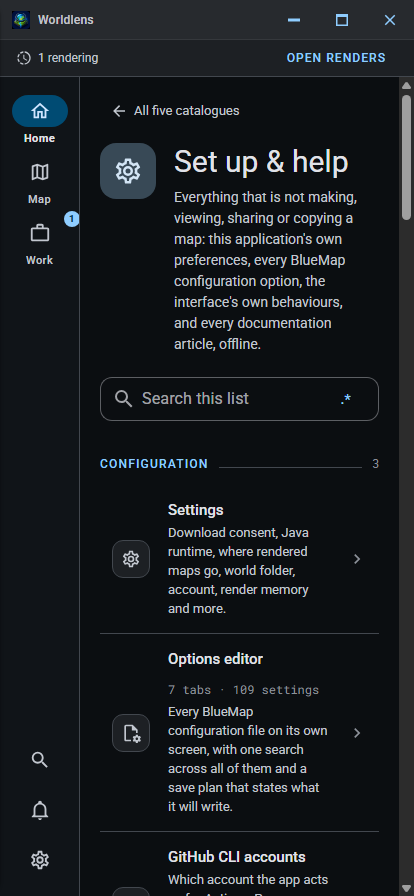

A redesigned Home catalogue at 414 by 896 CSS pixels: feature rows, their direct targets, the persistent application rail, and the catalogue's own search field without a horizontal escape route. Real Electron app with no map loaded: WORLDLENS_CAPTURE_MAP was not set, so this run had no rendered map to serve. The map area is the app's empty state, not a rendering failure. Nothing was fetched from any network. In this image, an opaque surface fills the window, so none of the map behind it is visible. Captured through Chromium's DevTools surface at the exact CSS viewport. The metrics sidecar records zero horizontal overflow, no clipped visible controls, and every primary compact target at least 44 by 44 CSS pixels.

## shell-1280x800

The application shell at 1280x800. Real Electron app with no map loaded: WORLDLENS_CAPTURE_MAP was not set, so this run had no rendered map to serve. The map area is the app's empty state, not a rendering failure. Nothing was fetched from any network. In this image, no map is loaded, so the application is showing the wizard for making one.

## shell-1920x1080

The application shell at 1920x1080. Real Electron app with no map loaded: WORLDLENS_CAPTURE_MAP was not set, so this run had no rendered map to serve. The map area is the app's empty state, not a rendering failure. Nothing was fetched from any network. In this image, no map is loaded, so the application is showing the wizard for making one.

## shell-1024x768

The application shell at 1024x768. Real Electron app with no map loaded: WORLDLENS_CAPTURE_MAP was not set, so this run had no rendered map to serve. The map area is the app's empty state, not a rendering failure. Nothing was fetched from any network. In this image, no map is loaded, so the application is showing the wizard for making one.

## shell-800x600-narrow

The application shell at 800x600-narrow. Real Electron app with no map loaded: WORLDLENS_CAPTURE_MAP was not set, so this run had no rendered map to serve. The map area is the app's empty state, not a rendering failure. Nothing was fetched from any network. In this image, no map is loaded, so the application is showing the wizard for making one.

## shell-scale-1x

The application shell at 100% display scale. Real Electron app with no map loaded: WORLDLENS_CAPTURE_MAP was not set, so this run had no rendered map to serve. The map area is the app's empty state, not a rendering failure. Nothing was fetched from any network. In this image, no map is loaded, so the application is showing the wizard for making one.

## shell-scale-1_25x

The application shell at 125% display scale. Real Electron app with no map loaded: WORLDLENS_CAPTURE_MAP was not set, so this run had no rendered map to serve. The map area is the app's empty state, not a rendering failure. Nothing was fetched from any network. In this image, no map is loaded, so the application is showing the wizard for making one.

## shell-scale-1_5x

The application shell at 150% display scale. Real Electron app with no map loaded: WORLDLENS_CAPTURE_MAP was not set, so this run had no rendered map to serve. The map area is the app's empty state, not a rendering failure. Nothing was fetched from any network. In this image, no map is loaded, so the application is showing the wizard for making one.

## shell-scale-2x

The application shell at 200% display scale. Real Electron app with no map loaded: WORLDLENS_CAPTURE_MAP was not set, so this run had no rendered map to serve. The map area is the app's empty state, not a rendering failure. Nothing was fetched from any network. In this image, no map is loaded, so the application is showing the wizard for making one.

## theme-light

The application shell in the light theme. Real Electron app with no map loaded: WORLDLENS_CAPTURE_MAP was not set, so this run had no rendered map to serve. The map area is the app's empty state, not a rendering failure. Nothing was fetched from any network. In this image, no map is loaded, so the application is showing the wizard for making one.

## theme-dark

The application shell in the dark theme. Real Electron app with no map loaded: WORLDLENS_CAPTURE_MAP was not set, so this run had no rendered map to serve. The map area is the app's empty state, not a rendering failure. Nothing was fetched from any network. In this image, no map is loaded, so the application is showing the wizard for making one.

## profiles-manager

The maps and servers manager on its own tab in the Work destination, listing the maps rendered on this computer and the remote BlueMap servers the application knows about, with the fields for adding another. Real Electron app with no map loaded: WORLDLENS_CAPTURE_MAP was not set, so this run had no rendered map to serve. The map area is the app's empty state, not a rendering failure. Nothing was fetched from any network. In this image, an opaque surface fills the window, so none of the map behind it is visible.

## backups

Backing a world or a rendered map up to GitHub release assets: what to pack, where it goes, and the notice saying nobody is signed in to GitHub on this computer yet. The screen states why this uses release assets rather than Git LFS, and the pointer format it writes. Real Electron app with no map loaded: WORLDLENS_CAPTURE_MAP was not set, so this run had no rendered map to serve. The map area is the app's empty state, not a rendering failure. Nothing was fetched from any network. In this image, an opaque surface fills the window, so none of the map behind it is visible.

## settings-drawer

The application settings, opened from the rail footer over whichever destination was showing. Real Electron app with no map loaded: WORLDLENS_CAPTURE_MAP was not set, so this run had no rendered map to serve. The map area is the app's empty state, not a rendering failure. Nothing was fetched from any network. In this image, no map is loaded, so the application is showing the wizard for making one.

## settings-section-mojang-download-consent

The "Mojang download consent" settings section, on its own browser-style tab inside the settings panel. Real Electron app with no map loaded: WORLDLENS_CAPTURE_MAP was not set, so this run had no rendered map to serve. The map area is the app's empty state, not a rendering failure. Nothing was fetched from any network. This image is cropped to the settings panel rather than showing the whole window.

## settings-section-java-runtime

The "Java runtime" settings section, on its own browser-style tab inside the settings panel. Real Electron app with no map loaded: WORLDLENS_CAPTURE_MAP was not set, so this run had no rendered map to serve. The map area is the app's empty state, not a rendering failure. Nothing was fetched from any network. This image is cropped to the settings panel rather than showing the whole window.

## settings-section-map-storage-directory

The "Where rendered maps go" settings section, on its own browser-style tab inside the settings panel. Real Electron app with no map loaded: WORLDLENS_CAPTURE_MAP was not set, so this run had no rendered map to serve. The map area is the app's empty state, not a rendering failure. Nothing was fetched from any network. This image is cropped to the settings panel rather than showing the whole window.

## settings-section-world-folder

The "World folder" settings section, on its own browser-style tab inside the settings panel. Real Electron app with no map loaded: WORLDLENS_CAPTURE_MAP was not set, so this run had no rendered map to serve. The map area is the app's empty state, not a rendering failure. Nothing was fetched from any network. This image is cropped to the settings panel rather than showing the whole window.

## settings-section-github-account

The "GitHub account" settings section, on its own browser-style tab inside the settings panel. Real Electron app with no map loaded: WORLDLENS_CAPTURE_MAP was not set, so this run had no rendered map to serve. The map area is the app's empty state, not a rendering failure. Nothing was fetched from any network. This image is cropped to the settings panel rather than showing the whole window.

## settings-section-language-and-tone

The "Language and tone" settings section, on its own browser-style tab inside the settings panel. Real Electron app with no map loaded: WORLDLENS_CAPTURE_MAP was not set, so this run had no rendered map to serve. The map area is the app's empty state, not a rendering failure. Nothing was fetched from any network. This image is cropped to the settings panel rather than showing the whole window.

## settings-search

The settings search, filtering the panel to the settings whose name, explanation or current value matches what was typed, and saying which tab each result lives on. Real Electron app with no map loaded: WORLDLENS_CAPTURE_MAP was not set, so this run had no rendered map to serve. The map area is the app's empty state, not a rendering failure. Nothing was fetched from any network. This image is cropped to the settings panel rather than showing the whole window.

## settings-regex-builder

The regex builder anchored to the settings search, showing the pattern, the supported flags, the guided token palette and the live matches against the text on screen. Real Electron app with no map loaded: WORLDLENS_CAPTURE_MAP was not set, so this run had no rendered map to serve. The map area is the app's empty state, not a rendering failure. Nothing was fetched from any network. This image is cropped to the regex builder rather than showing the whole window.

## settings-vocabulary

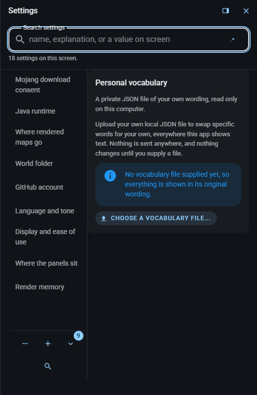

The personal-vocabulary settings row, present in its own settings section whether or not a file has ever been uploaded: its honest no-file state on a throwaway capture profile. Real Electron app with no map loaded: WORLDLENS_CAPTURE_MAP was not set, so this run had no rendered map to serve. The map area is the app's empty state, not a rendering failure. Nothing was fetched from any network. This image is cropped to the settings panel rather than showing the whole window.

## settings-notification-duration

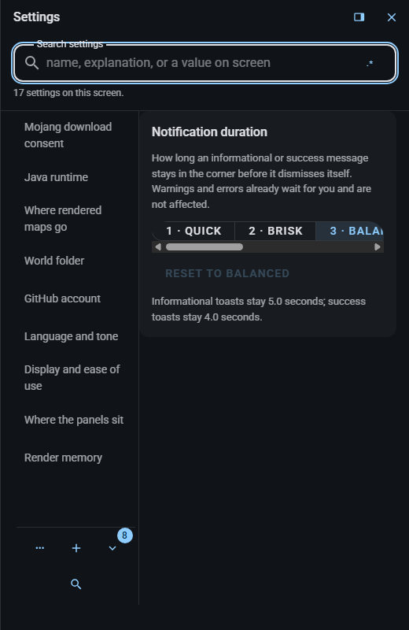

The notification duration row in settings: how long an informational or success message stays in the corner before it dismisses itself, with the level this capture profile shipped on. Real Electron app with no map loaded: WORLDLENS_CAPTURE_MAP was not set, so this run had no rendered map to serve. The map area is the app's empty state, not a rendering failure. Nothing was fetched from any network. This image is cropped to the settings panel rather than showing the whole window.

## config-screen

The options editor as it opens. Real Electron app with no map loaded: WORLDLENS_CAPTURE_MAP was not set, so this run had no rendered map to serve. The map area is the app's empty state, not a rendering failure. Nothing was fetched from any network. In this image, an opaque surface fills the window, so none of the map behind it is visible. The editor is showing BlueMap's own generated defaults, because the throwaway profile this run uses has no config folder on disk, and it says so in the notice across the top. Every setting, tab and control in the image is real, live and savable; what is absent is a folder read off this machine.

## config-tab-core

The options editor, the "Core" tab, with the settings that tab owns. Real Electron app with no map loaded: WORLDLENS_CAPTURE_MAP was not set, so this run had no rendered map to serve. The map area is the app's empty state, not a rendering failure. Nothing was fetched from any network. In this image, an opaque surface fills the window, so none of the map behind it is visible. The editor is showing BlueMap's own generated defaults, because the throwaway profile this run uses has no config folder on disk, and it says so in the notice across the top. Every setting, tab and control in the image is real, live and savable; what is absent is a folder read off this machine.

## config-tab-maps

The options editor, the "Maps" tab, with the settings that tab owns. Real Electron app with no map loaded: WORLDLENS_CAPTURE_MAP was not set, so this run had no rendered map to serve. The map area is the app's empty state, not a rendering failure. Nothing was fetched from any network. In this image, an opaque surface fills the window, so none of the map behind it is visible. The editor is showing BlueMap's own generated defaults, because the throwaway profile this run uses has no config folder on disk, and it says so in the notice across the top. Every setting, tab and control in the image is real, live and savable; what is absent is a folder read off this machine.

## config-tab-storages

The options editor, the "Storages" tab, with the settings that tab owns. Real Electron app with no map loaded: WORLDLENS_CAPTURE_MAP was not set, so this run had no rendered map to serve. The map area is the app's empty state, not a rendering failure. Nothing was fetched from any network. In this image, an opaque surface fills the window, so none of the map behind it is visible. The editor is showing BlueMap's own generated defaults, because the throwaway profile this run uses has no config folder on disk, and it says so in the notice across the top. Every setting, tab and control in the image is real, live and savable; what is absent is a folder read off this machine.

## config-tab-web-app

The options editor, the "Web app" tab, with the settings that tab owns. Real Electron app with no map loaded: WORLDLENS_CAPTURE_MAP was not set, so this run had no rendered map to serve. The map area is the app's empty state, not a rendering failure. Nothing was fetched from any network. In this image, an opaque surface fills the window, so none of the map behind it is visible. The editor is showing BlueMap's own generated defaults, because the throwaway profile this run uses has no config folder on disk, and it says so in the notice across the top. Every setting, tab and control in the image is real, live and savable; what is absent is a folder read off this machine.

## config-tab-web-server

The options editor, the "Web server" tab, with the settings that tab owns. Real Electron app with no map loaded: WORLDLENS_CAPTURE_MAP was not set, so this run had no rendered map to serve. The map area is the app's empty state, not a rendering failure. Nothing was fetched from any network. In this image, an opaque surface fills the window, so none of the map behind it is visible. The editor is showing BlueMap's own generated defaults, because the throwaway profile this run uses has no config folder on disk, and it says so in the notice across the top. Every setting, tab and control in the image is real, live and savable; what is absent is a folder read off this machine.

## config-tab-server-plugin

The options editor, the "Server plugin" tab, with the settings that tab owns. Real Electron app with no map loaded: WORLDLENS_CAPTURE_MAP was not set, so this run had no rendered map to serve. The map area is the app's empty state, not a rendering failure. Nothing was fetched from any network. In this image, an opaque surface fills the window, so none of the map behind it is visible. The editor is showing BlueMap's own generated defaults, because the throwaway profile this run uses has no config folder on disk, and it says so in the notice across the top. Every setting, tab and control in the image is real, live and savable; what is absent is a folder read off this machine.

## config-tab-run

The options editor, the "Run" tab, with the settings that tab owns. Real Electron app with no map loaded: WORLDLENS_CAPTURE_MAP was not set, so this run had no rendered map to serve. The map area is the app's empty state, not a rendering failure. Nothing was fetched from any network. In this image, an opaque surface fills the window, so none of the map behind it is visible. The editor is showing BlueMap's own generated defaults, because the throwaway profile this run uses has no config folder on disk, and it says so in the notice across the top. Every setting, tab and control in the image is real, live and savable; what is absent is a folder read off this machine.

## config-tab-history

The options editor, the "History" tab, with the settings that tab owns. Real Electron app with no map loaded: WORLDLENS_CAPTURE_MAP was not set, so this run had no rendered map to serve. The map area is the app's empty state, not a rendering failure. Nothing was fetched from any network. In this image, an opaque surface fills the window, so none of the map behind it is visible. The editor is showing BlueMap's own generated defaults, because the throwaway profile this run uses has no config folder on disk, and it says so in the notice across the top. Every setting, tab and control in the image is real, live and savable; what is absent is a folder read off this machine.

## config-search

The options editor's search, which reaches every setting on all of the tabs at once and says which tab each result lives on. Real Electron app with no map loaded: WORLDLENS_CAPTURE_MAP was not set, so this run had no rendered map to serve. The map area is the app's empty state, not a rendering failure. Nothing was fetched from any network. In this image, an opaque surface fills the window, so none of the map behind it is visible. The editor is showing BlueMap's own generated defaults, because the throwaway profile this run uses has no config folder on disk, and it says so in the notice across the top. Every setting, tab and control in the image is real, live and savable; what is absent is a folder read off this machine.

## config-regex-builder

The regex builder anchored to the options editor's search bar. Real Electron app with no map loaded: WORLDLENS_CAPTURE_MAP was not set, so this run had no rendered map to serve. The map area is the app's empty state, not a rendering failure. Nothing was fetched from any network. This image is cropped to the regex builder rather than showing the whole window.

## config-delete-gate

The super confirmation that guards deleting a map's configuration: two keys, then a full-travel slider, with an emergency exit that is always available. Real Electron app with no map loaded: WORLDLENS_CAPTURE_MAP was not set, so this run had no rendered map to serve. The map area is the app's empty state, not a rendering failure. Nothing was fetched from any network. This image is cropped to the confirmation popover rather than showing the whole window.

## config-history

The config folder's version-history tab, including its honest empty state when this throwaway profile has no folder attached. Real Electron app with no map loaded: WORLDLENS_CAPTURE_MAP was not set, so this run had no rendered map to serve. The map area is the app's empty state, not a rendering failure. Nothing was fetched from any network. This image is cropped to the version-history panel rather than showing the whole window.

## projects-screen

The Projects screen, showing the real empty state and the path into a new render project. Real Electron app with no map loaded: WORLDLENS_CAPTURE_MAP was not set, so this run had no rendered map to serve. The map area is the app's empty state, not a rendering failure. Nothing was fetched from any network. This image is cropped to the Projects screen rather than showing the whole window.

## ci-render-screen

The CI-render screen, with its honest repository fields and the preflight route that refuses before uploading anything. Real Electron app with no map loaded: WORLDLENS_CAPTURE_MAP was not set, so this run had no rendered map to serve. The map area is the app's empty state, not a rendering failure. Nothing was fetched from any network. This image is cropped to the CI-render screen rather than showing the whole window.

## pages-publishing-screen

The Pages publishing screen: the searchable render list, the repository fields, and the check that reports what publishing would push before anything is pushed. Real Electron app with no map loaded: WORLDLENS_CAPTURE_MAP was not set, so this run had no rendered map to serve. The map area is the app's empty state, not a rendering failure. Nothing was fetched from any network. This image is cropped to the Pages publishing screen rather than showing the whole window.

## authenticator-screen

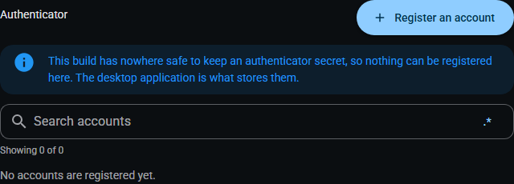

The built-in authenticator, on its own tab in the Work destination, with its honest empty state on a throwaway profile that has never registered a TOTP account. Real Electron app with no map loaded: WORLDLENS_CAPTURE_MAP was not set, so this run had no rendered map to serve. The map area is the app's empty state, not a rendering failure. Nothing was fetched from any network. This image is cropped to the authenticator screen rather than showing the whole window.

## lock-list-screen

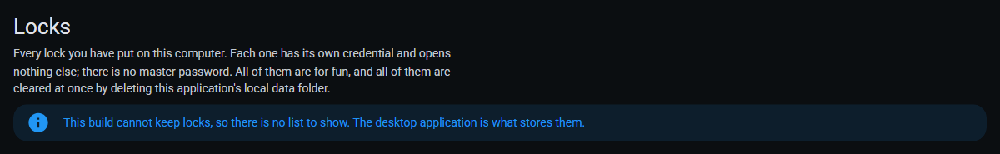

The lock list, enumerating every toy lock on this computer, with its honest empty state on a throwaway profile that has never locked an element. Real Electron app with no map loaded: WORLDLENS_CAPTURE_MAP was not set, so this run had no rendered map to serve. The map area is the app's empty state, not a rendering failure. Nothing was fetched from any network. This image is cropped to the lock list rather than showing the whole window.

## support-tickets-screen

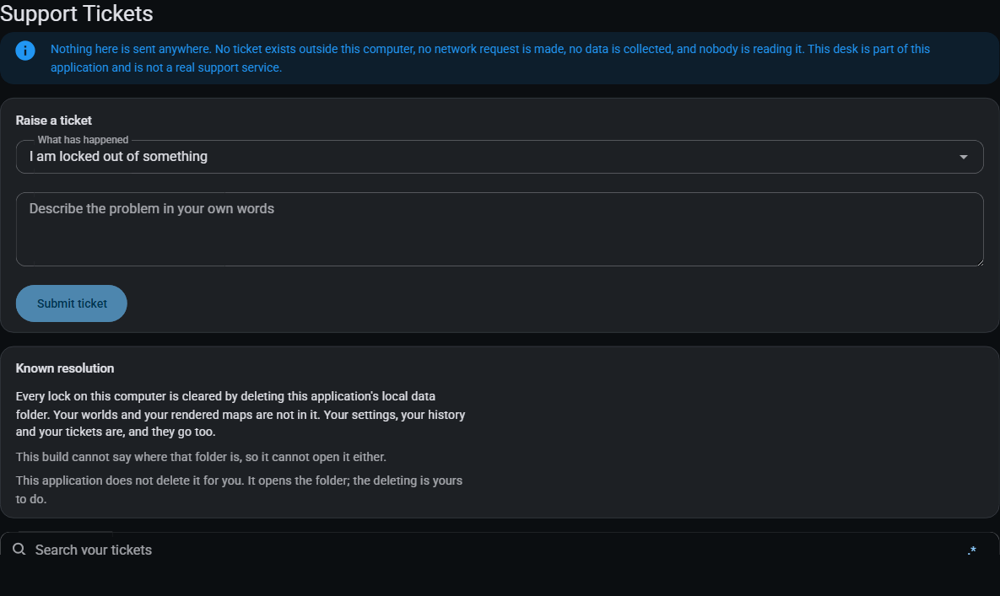

The recovery desk, dressed as a support desk: a ticket form and the plain, unstyled line stating that nothing is ever sent anywhere. Real Electron app with no map loaded: WORLDLENS_CAPTURE_MAP was not set, so this run had no rendered map to serve. The map area is the app's empty state, not a rendering failure. Nothing was fetched from any network. This image is cropped to the Support Tickets screen rather than showing the whole window.

## structures-screen

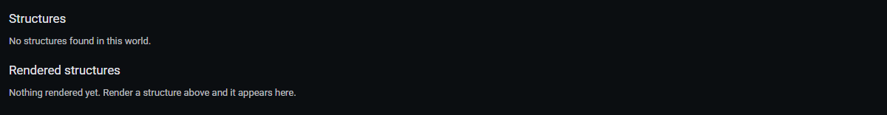

The Structures screen, listing every structure file a world scan found and, once rendered, the render for each one - with its honest empty state on a throwaway profile with no world scanned yet. Real Electron app with no map loaded: WORLDLENS_CAPTURE_MAP was not set, so this run had no rendered map to serve. The map area is the app's empty state, not a rendering failure. Nothing was fetched from any network. This image is cropped to the Structures screen rather than showing the whole window.

## drop-render-zone

The drop-render zone at the top of the Structures screen: drag a structure or schematic file straight onto it, or use the ordinary button beside it that does exactly the same thing. Real Electron app with no map loaded: WORLDLENS_CAPTURE_MAP was not set, so this run had no rendered map to serve. The map area is the app's empty state, not a rendering failure. Nothing was fetched from any network. This image is cropped to the drop-render zone rather than showing the whole window.

## chunker-screen

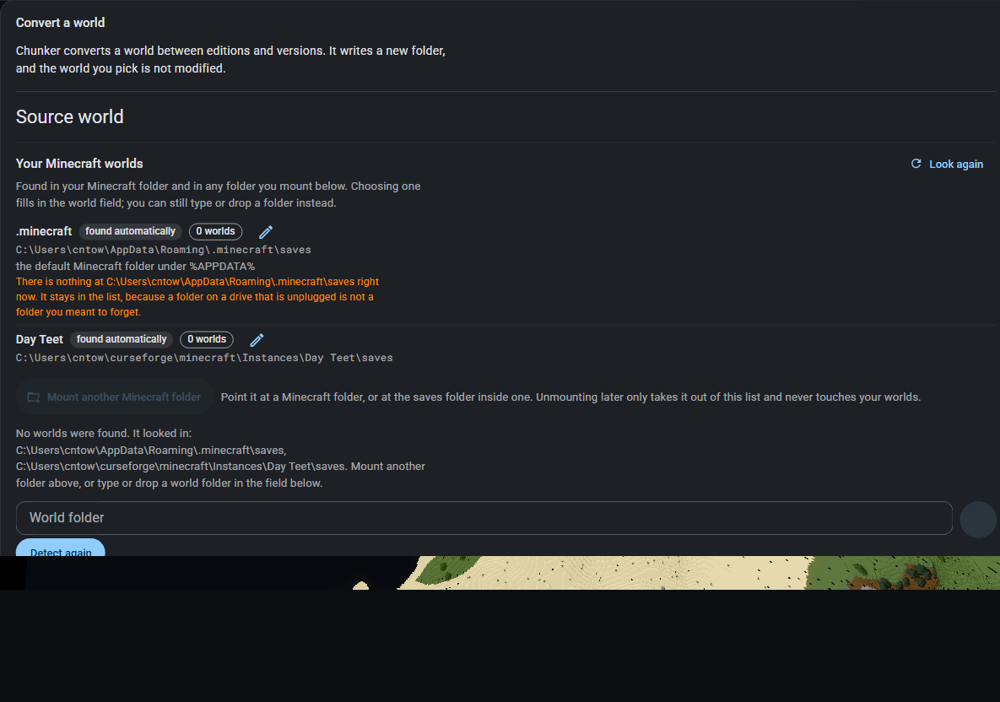

The world conversion screen, on its own tab in the Work destination: the source and destination fields and the four execution routes a conversion can be run through. Real Electron app with no map loaded: WORLDLENS_CAPTURE_MAP was not set, so this run had no rendered map to serve. The map area is the app's empty state, not a rendering failure. Nothing was fetched from any network. This image is cropped to the conversion screen rather than showing the whole window.

## ollama-screen

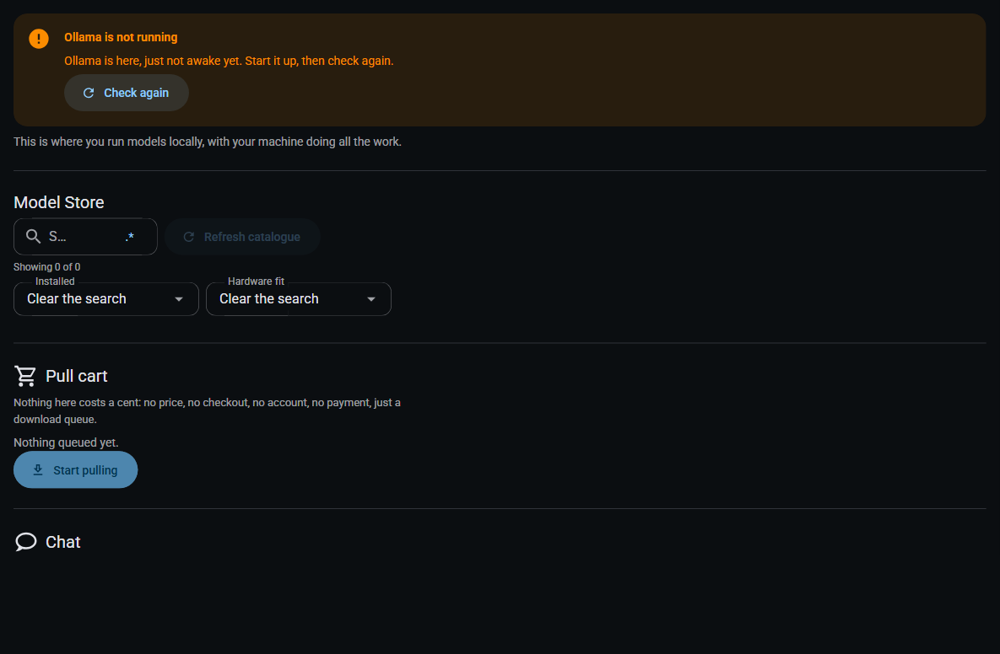

The Ollama suite manager, on its own tab in the Work destination, on a capture profile with no Ollama runtime installed: the honest missing-runtime warning and the guidance that goes with it. Real Electron app with no map loaded: WORLDLENS_CAPTURE_MAP was not set, so this run had no rendered map to serve. The map area is the app's empty state, not a rendering failure. Nothing was fetched from any network. This image is cropped to the Ollama screen rather than showing the whole window.

## browser-extension-screen

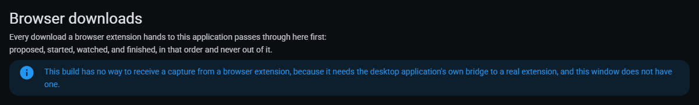

The browser-extension downloads screen, with its honest empty state on a throwaway profile where the extension has never handed a download over. Real Electron app with no map loaded: WORLDLENS_CAPTURE_MAP was not set, so this run had no rendered map to serve. The map area is the app's empty state, not a rendering failure. Nothing was fetched from any network. This image is cropped to the browser extension downloads screen rather than showing the whole window.

## eula-viewer

The EULA viewer embedded in Settings, with the bundled or cached licence copy, its provenance and its searchable section tabs. Real Electron app with no map loaded: WORLDLENS_CAPTURE_MAP was not set, so this run had no rendered map to serve. The map area is the app's empty state, not a rendering failure. Nothing was fetched from any network. This image is cropped to the EULA viewer rather than showing the whole window.

## notifications-rail-bell

The live Notification bell in the application rail, carrying its unread badge before it opens the history anchored beside it. Real Electron app with no map loaded: WORLDLENS_CAPTURE_MAP was not set, so this run had no rendered map to serve. The map area is the app's empty state, not a rendering failure. Nothing was fetched from any network. This image is cropped to the rail notification bell rather than showing the whole window.

## notifications-history

The notification centre, so a message that has already faded away is still readable, searchable and filterable by level. Real Electron app with no map loaded: WORLDLENS_CAPTURE_MAP was not set, so this run had no rendered map to serve. The map area is the app's empty state, not a rendering failure. Nothing was fetched from any network. This image is cropped to the notification centre rather than showing the whole window.

## palette

The command palette, opened with Ctrl+Shift+F: every command, setting and destination the application has, in one searchable list. Real Electron app with no map loaded: WORLDLENS_CAPTURE_MAP was not set, so this run had no rendered map to serve. The map area is the app's empty state, not a rendering failure. Nothing was fetched from any network. In this image, an opaque surface fills the window, so none of the map behind it is visible.

## palette-search

The command palette filtered by a search, with a setting row that carries its own live control - changing it here changes the real setting, the same way changing it on its own page would. Real Electron app with no map loaded: WORLDLENS_CAPTURE_MAP was not set, so this run had no rendered map to serve. The map area is the app's empty state, not a rendering failure. Nothing was fetched from any network. This image is cropped to the command palette rather than showing the whole window.

## tab-strip

The browser-style tab strip inside the Work destination: the jobs that have actually been opened rather than every destination the application has, their seeded groups, the new-tab menu, the overflow control that appears only once something stops fitting, and the tab finder's own magnifier. Real Electron app with no map loaded: WORLDLENS_CAPTURE_MAP was not set, so this run had no rendered map to serve. The map area is the app's empty state, not a rendering failure. Nothing was fetched from any network. This image is cropped to the tab strip rather than showing the whole window.

## tab-context-menu

Right-clicking a tab: its own management commands, with the keyboard-reachable filter every context menu in this application carries and the working shortcut printed beside each item that has one. Real Electron app with no map loaded: WORLDLENS_CAPTURE_MAP was not set, so this run had no rendered map to serve. The map area is the app's empty state, not a rendering failure. Nothing was fetched from any network. This image is cropped to the tab's context menu rather than showing the whole window.

## tab-finder

The tab finder: search this strip, search every open tab in every window, search groups by name, and both text bulk closes, each with its own anchored regex builder. Real Electron app with no map loaded: WORLDLENS_CAPTURE_MAP was not set, so this run had no rendered map to serve. The map area is the app's empty state, not a rendering failure. Nothing was fetched from any network. This image is cropped to the tab finder rather than showing the whole window.

## tab-bulk-close-preview

Close tabs containing text, previewing exactly which tabs the pattern matches and what closing them would do, before anything closes. Real Electron app with no map loaded: WORLDLENS_CAPTURE_MAP was not set, so this run had no rendered map to serve. The map area is the app's empty state, not a rendering failure. Nothing was fetched from any network. This image is cropped to the bulk-close panel rather than showing the whole window.

## appearance-context-menu

A tab's own context menu: its management commands, then "Edit tab appearance..." with its working Ctrl+Shift+F10 shortcut printed beside it, and the menu's own searchable filter at the top. Real Electron app with no map loaded: WORLDLENS_CAPTURE_MAP was not set, so this run had no rendered map to serve. The map area is the app's empty state, not a rendering failure. Nothing was fetched from any network. This image is cropped to the tab's context menu rather than showing the whole window.

## appearance-typography

The appearance editor's Text tab: every installed and bundled font with its own live preview, size, weight, style and the rest of the Word-depth typography controls, editing this tab's own label live. Real Electron app with no map loaded: WORLDLENS_CAPTURE_MAP was not set, so this run had no rendered map to serve. The map area is the app's empty state, not a rendering failure. Nothing was fetched from any network. This image is cropped to the appearance editor rather than showing the whole window.

## appearance-surface

The appearance editor's Surface tab: background and border colour, border style, radius, spacing, shadow and opacity for this tab, each with a reset of its own. Real Electron app with no map loaded: WORLDLENS_CAPTURE_MAP was not set, so this run had no rendered map to serve. The map area is the app's empty state, not a rendering failure. Nothing was fetched from any network. This image is cropped to the appearance editor rather than showing the whole window.

## infinite-colour-picker

The infinite colour picker: a continuous field rather than a swatch grid, translated across named colours, hex, RGB, HSL, HSV, HWB, CIELAB/LCH, OKLab/OKLCH and CMYK, with a contrast readout. Real Electron app with no map loaded: WORLDLENS_CAPTURE_MAP was not set, so this run had no rendered map to serve. The map area is the app's empty state, not a rendering failure. Nothing was fetched from any network. This image is cropped to the infinite colour picker rather than showing the whole window.

## wizard-1-world

The make-a-map wizard on its first step, asking for the world folder, with its five steps listed across the top. Real Electron app with no map loaded: WORLDLENS_CAPTURE_MAP was not set, so this run had no rendered map to serve. The map area is the app's empty state, not a rendering failure. Nothing was fetched from any network. In this image, no map is loaded, so the application is showing the wizard for making one.

## wizard-ssh-world-source

The SSH world-source checklist inside the first wizard step: saved key-only machines, explicit host-key review, remote-world inspection, and a local fetch destination. Real Electron app with no map loaded: WORLDLENS_CAPTURE_MAP was not set, so this run had no rendered map to serve. The map area is the app's empty state, not a rendering failure. Nothing was fetched from any network. This image is cropped to the SSH world-source checklist rather than showing the whole window.

## wizard-docker-world-source-390x844-200pct

The local Docker world-source checklist at a 390 by 844 CSS-pixel viewport and 200% device scale: Docker's real state, actual containers and volumes, a browsed local destination, live-copy risk acknowledgement, and honest progress. Real Electron app with no map loaded: WORLDLENS_CAPTURE_MAP was not set, so this run had no rendered map to serve. The map area is the app's empty state, not a rendering failure. Nothing was fetched from any network. In this image, no map is loaded, so the application is showing the wizard for making one. Captured through Chromium's own DevTools surface so the image uses the same exact CSS viewport and device scale as the metrics. The metrics record zero horizontal overflow, outer or internal control clipping, or undersized interactive targets.

## wizard-1-world-read

The wizard's first step after the world folder has been read: it names the dimensions it found and how many region files each of them holds. Real Electron app with no map loaded: WORLDLENS_CAPTURE_MAP was not set, so this run had no rendered map to serve. The map area is the app's empty state, not a rendering failure. Nothing was fetched from any network. In this image, no map is loaded, so the application is showing the wizard for making one.

## wizard-2-name-and-dimension

The make-a-map wizard on its "Name and dimension" step. Real Electron app with no map loaded: WORLDLENS_CAPTURE_MAP was not set, so this run had no rendered map to serve. The map area is the app's empty state, not a rendering failure. Nothing was fetched from any network. In this image, no map is loaded, so the application is showing the wizard for making one.

## wizard-3-options

The make-a-map wizard on its "Options" step. Real Electron app with no map loaded: WORLDLENS_CAPTURE_MAP was not set, so this run had no rendered map to serve. The map area is the app's empty state, not a rendering failure. Nothing was fetched from any network. In this image, no map is loaded, so the application is showing the wizard for making one.

## wizard-4-where-it-goes

The make-a-map wizard on its "Where it goes" step. Real Electron app with no map loaded: WORLDLENS_CAPTURE_MAP was not set, so this run had no rendered map to serve. The map area is the app's empty state, not a rendering failure. Nothing was fetched from any network. In this image, no map is loaded, so the application is showing the wizard for making one.

## wizard-5-review

The make-a-map wizard on its "Review" step. Real Electron app with no map loaded: WORLDLENS_CAPTURE_MAP was not set, so this run had no rendered map to serve. The map area is the app's empty state, not a rendering failure. Nothing was fetched from any network. In this image, no map is loaded, so the application is showing the wizard for making one.

## wizard-release-downloads

The release downloads panel, which offers to fetch a world from a GitHub release for somebody with no Minecraft save on this machine. Real Electron app with no map loaded: WORLDLENS_CAPTURE_MAP was not set, so this run had no rendered map to serve. The map area is the app's empty state, not a rendering failure. Nothing was fetched from any network. This image is cropped to the release downloads panel rather than showing the whole window.

## kid-home

Kid Mode's Home, and the default view of a fresh install: kidMode.ts's own KEY_ENABLED flag defaults to true, so this - not the adult shell - is the very first screen this application ever shows anybody. The GO hero card, the five catalogues drawn as picture-first 'lands', what the app is doing right now, and the maps and servers this computer already knows about. Real Electron app with no map loaded: WORLDLENS_CAPTURE_MAP was not set, so this run had no rendered map to serve. The map area is the app's empty state, not a rendering failure. Nothing was fetched from any network. In this image, no map is loaded; the map area is the app's empty state. Kid Mode always paints from its own fixed 'kid' Vuetify theme (KID_SCHEME in kidTheme.ts) rather than the light/dark/contrast scheme chosen in Adult Mode's own Settings - App.vue's own watcher snaps the live theme name straight back to 'kid' the instant Kid Mode is active, so there is no separate light/dark/contrast variant of any Kid Mode surface to capture.

## kid-rail

Kid Mode's own rail, cropped from the Home capture above: Home, Explore, My jobs and Stickers as big picture-first destinations with the level badge and XP bar in the status header above them, then Find, Messages and the grown-up gate as small footer actions - the same three-destination-plus-footer shape the adult rail has, per KidRail.vue's own doc comment. Real Electron app with no map loaded: WORLDLENS_CAPTURE_MAP was not set, so this run had no rendered map to serve. The map area is the app's empty state, not a rendering failure. Nothing was fetched from any network. This image is cropped to the Kid Mode rail rather than showing the whole window.

## kid-catalogue

One of Kid Mode's five catalogues, opened as a 'land' from Kid Home: every feature it holds as its own picture-first row with the real shipped blurb underneath, grouped under headings, with the same search field and anchored regex builder every other catalogue page in this application carries (ConfigSearchField, reused rather than hand-rolled, per KidCataloguePage.vue's own doc comment). Real Electron app with no map loaded: WORLDLENS_CAPTURE_MAP was not set, so this run had no rendered map to serve. The map area is the app's empty state, not a rendering failure. Nothing was fetched from any network. In this image, no map is loaded; the map area is the app's empty state.

## kid-job-strip

Kid Mode's Work view: WorkPane re-hosted rather than reimplemented, per KidJobStrip.vue's own doc comment - the exact same tab strip, seeded groups, pinning, drag reorder and overflow as Adult Mode's own Work destination, wearing Kid Mode's own labels (applied through WorkPane's existing renamePage) and a 64px-minimum chip floor rather than the adult shell's 44px one. Real Electron app with no map loaded: WORLDLENS_CAPTURE_MAP was not set, so this run had no rendered map to serve. The map area is the app's empty state, not a rendering failure. Nothing was fetched from any network. In this image, no map is loaded; the map area is the app's empty state.

## kid-stickers

The sticker book on a fresh capture profile: every sticker this build knows about, each naming the real feature it is earned from and doubling as a second route into that feature's catalogue rather than a dead trophy shelf, none of them won yet - a fresh profile has completed nothing, and the book says so plainly (KidStickerBook.vue's own doc comment: 'a sticker that has not been won says so plainly; nothing is hidden or teased'). Real Electron app with no map loaded: WORLDLENS_CAPTURE_MAP was not set, so this run had no rendered map to serve. The map area is the app's empty state, not a rendering failure. Nothing was fetched from any network. In this image, no map is loaded; the map area is the app's empty state.

## kid-gate-no-credential

![The grown-up gate in its no-credential-configured state, which is the state every fresh install actually starts in: nobody has ever set the shared restricted-mode code on this computer, so KidGrownUpGate.vue lets one press go straight through to Adult Mode rather than demanding a code that was never set - the mechanism its own doc comment says exists precisely so 'Kid Mode must never become a one-way door'. The honesty line at the bottom names this as a user-experience lock, not a security lock, and names the real reset route rather than gesturing at it](kid-gate-no-credential.png)

The grown-up gate in its no-credential-configured state, which is the state every fresh install actually starts in: nobody has ever set the shared restricted-mode code on this computer, so KidGrownUpGate.vue lets one press go straight through to Adult Mode rather than demanding a code that was never set - the mechanism its own doc comment says exists precisely so 'Kid Mode must never become a one-way door'. The honesty line at the bottom names this as a user-experience lock, not a security lock, and names the real reset route rather than gesturing at it. Real Electron app with no map loaded: WORLDLENS_CAPTURE_MAP was not set, so this run had no rendered map to serve. The map area is the app's empty state, not a rendering failure. Nothing was fetched from any network. In this image, no map is loaded; the map area is the app's empty state.

## kid-mode-settings-row

The Kid Mode settings row, reached the moment this run first leaves Kid Mode through its own grown-up gate: the Kid Mode/Adult Mode choice, showing Adult Mode selected because this capture is looking at the row from inside Adult Mode; the child's name; the celebration and sound switches; and the label-style choice. The accessible name of every control keeps the real feature name at all three label styles, per this row's own doc comment. Real Electron app with no map loaded: WORLDLENS_CAPTURE_MAP was not set, so this run had no rendered map to serve. The map area is the app's empty state, not a rendering failure. Nothing was fetched from any network. This image is cropped to the settings panel rather than showing the whole window.

## kid-home-390

Kid Home at 390 by 844 CSS pixels - the same phone width the redesigned adult shell proves itself at (COMPACT_PHONE_VIEWPORTS): the rail, hero, five lands and both panels holding their layout rather than being narrowed to a scroll of unreadable pieces, at Kid Mode's own 64px-minimum touch targets. Real Electron app with no map loaded: WORLDLENS_CAPTURE_MAP was not set, so this run had no rendered map to serve. The map area is the app's empty state, not a rendering failure. Nothing was fetched from any network. In this image, no map is loaded; the map area is the app's empty state. Captured through Chromium's DevTools surface at the exact CSS viewport, the same technique 'captures the redesigned Home shell at compact phone viewports' uses for the adult shell.

## kid-catalogue-maps

Kid Mode's "Your maps" land (the shipped feature name is "Your maps"; position 1 of 5 on Home) - one of the five catalogues, alongside the first one the existing 'Kid catalogue page' capture already proves above: every feature it holds as its own picture-first row with the real shipped blurb underneath, the same search field and anchored regex builder every catalogue page in this application carries. Real Electron app with no map loaded: WORLDLENS_CAPTURE_MAP was not set, so this run had no rendered map to serve. The map area is the app's empty state, not a rendering failure. Nothing was fetched from any network. In this image, no map is loaded; the map area is the app's empty state.

## kid-catalogue-share

Kid Mode's "Show people" land (the shipped feature name is "Share a map"; position 2 of 5 on Home) - one of the five catalogues, alongside the first one the existing 'Kid catalogue page' capture already proves above: every feature it holds as its own picture-first row with the real shipped blurb underneath, the same search field and anchored regex builder every catalogue page in this application carries. Real Electron app with no map loaded: WORLDLENS_CAPTURE_MAP was not set, so this run had no rendered map to serve. The map area is the app's empty state, not a rendering failure. Nothing was fetched from any network. In this image, no map is loaded; the map area is the app's empty state.

## kid-catalogue-copy

Kid Mode's "Keep it safe" land (the shipped feature name is "Keep a copy"; position 3 of 5 on Home) - one of the five catalogues, alongside the first one the existing 'Kid catalogue page' capture already proves above: every feature it holds as its own picture-first row with the real shipped blurb underneath, the same search field and anchored regex builder every catalogue page in this application carries. Real Electron app with no map loaded: WORLDLENS_CAPTURE_MAP was not set, so this run had no rendered map to serve. The map area is the app's empty state, not a rendering failure. Nothing was fetched from any network. In this image, no map is loaded; the map area is the app's empty state.

## kid-catalogue-setup

Kid Mode's "Buttons & help" land (the shipped feature name is "Set up & help"; position 4 of 5 on Home) - one of the five catalogues, alongside the first one the existing 'Kid catalogue page' capture already proves above: every feature it holds as its own picture-first row with the real shipped blurb underneath, the same search field and anchored regex builder every catalogue page in this application carries. Real Electron app with no map loaded: WORLDLENS_CAPTURE_MAP was not set, so this run had no rendered map to serve. The map area is the app's empty state, not a rendering failure. Nothing was fetched from any network. In this image, no map is loaded; the map area is the app's empty state.

## kid-explore

Kid Mode's Explore view: the one screen in this whole shell where the real map canvas shows through its own chrome instead of being covered by it (`.wl-kid__map`'s own doc comment in KidShell.vue names this as the deliberate exception to every other kid-mode view painting an opaque surface over the entire window) - the free-flight controls, zoom buttons, control bar and main menu the #map slot forwards, over the viewer's own empty state, since this run served no rendered map to load. Real Electron app with no map loaded: WORLDLENS_CAPTURE_MAP was not set, so this run had no rendered map to serve. The map area is the app's empty state, not a rendering failure. Nothing was fetched from any network. In this image, no map is loaded; the map area is the app's empty state.

## kid-find-palette

![The command palette, opened from Kid Mode's own rail 'Find anything' footer button rather than the Ctrl+Shift+F shortcut the adult shell's own 'Command palette' capture uses: KidShell.vue's openPalette() routes through the real 'Set up & help' catalogue feature setup.how-the-interface-behaves.command-palette and activates it exactly as any other feature target would, rather than a fabricated row invented for this button - so this is the same global palette every other capture in this file already proves, reached the way a child actually presses it](kid-find-palette.png)

The command palette, opened from Kid Mode's own rail 'Find anything' footer button rather than the Ctrl+Shift+F shortcut the adult shell's own 'Command palette' capture uses: KidShell.vue's openPalette() routes through the real 'Set up & help' catalogue feature setup.how-the-interface-behaves.command-palette and activates it exactly as any other feature target would, rather than a fabricated row invented for this button - so this is the same global palette every other capture in this file already proves, reached the way a child actually presses it. Real Electron app with no map loaded: WORLDLENS_CAPTURE_MAP was not set, so this run had no rendered map to serve. The map area is the app's empty state, not a rendering failure. Nothing was fetched from any network. In this image, an opaque surface fills the window, so none of the map behind it is visible.

## kid-messages

![The notification centre, opened from Kid Mode's own rail 'Messages' footer button through the same 'Set up & help' catalogue route Find above uses (setup.how-the-interface-behaves.notification-centre). NotificationPanel.vue anchors this overlay to the adult rail's own bell button by CSS selector, and that button does not exist while Kid Mode's own tree is mounted in its place - this capture is the honest, driven proof of whatever Vuetify's v-menu genuinely does when its declared activator selector resolves to nothing, not an assumption about it](kid-messages.png)

The notification centre, opened from Kid Mode's own rail 'Messages' footer button through the same 'Set up & help' catalogue route Find above uses (setup.how-the-interface-behaves.notification-centre). NotificationPanel.vue anchors this overlay to the adult rail's own bell button by CSS selector, and that button does not exist while Kid Mode's own tree is mounted in its place - this capture is the honest, driven proof of whatever Vuetify's v-menu genuinely does when its declared activator selector resolves to nothing, not an assumption about it. Real Electron app with no map loaded: WORLDLENS_CAPTURE_MAP was not set, so this run had no rendered map to serve. The map area is the app's empty state, not a rendering failure. Nothing was fetched from any network. This image is cropped to the notifications panel rather than showing the whole window.

## kid-catalogue-regex-builder

The anchored regex builder, opened from a Kid catalogue's own search field - ConfigSearchField, the identical component and the identical 'Open the regex builder' control the adult settings search already proves above, reused rather than hand-rolled per KidCataloguePage.vue's own doc comment: the pattern, the supported flags, the guided token palette and the live matches against this catalogue's own rows. Real Electron app with no map loaded: WORLDLENS_CAPTURE_MAP was not set, so this run had no rendered map to serve. The map area is the app's empty state, not a rendering failure. Nothing was fetched from any network. This image is cropped to the regex builder rather than showing the whole window.

## kid-home-funny-1

Kid Home with the English funny-level slider seeded to 1 (fully serious) and reloaded so it takes effect (worldlens.language.funny.en, the persisted key setupI18n.ts reads): the hero heading and blurb read at their plainest voiced level - compare against the funny-level-5 capture immediately below, the identical screen at the opposite extreme. Real Electron app with no map loaded: WORLDLENS_CAPTURE_MAP was not set, so this run had no rendered map to serve. The map area is the app's empty state, not a rendering failure. Nothing was fetched from any network. In this image, no map is loaded; the map area is the app's empty state.

## kid-home-funny-5

Kid Home with the English funny-level slider seeded to 5 (maximum playfulness) and reloaded so it takes effect: the same hero heading and blurb as the funny-level-1 capture above, at the opposite end of the same slider - the voice changes, the facts (what the GO button does, what each land opens) never do. Real Electron app with no map loaded: WORLDLENS_CAPTURE_MAP was not set, so this run had no rendered map to serve. The map area is the app's empty state, not a rendering failure. Nothing was fetched from any network. In this image, no map is loaded; the map area is the app's empty state.

## kid-home-yue

![Kid Home with the language mode seeded to Cantonese (worldlens.language.mode = "yue") and reloaded so it takes effect. This is the first capture in this whole harness's history to exercise the language mode on any surface, and it found a real, honest gap rather than a clean result: the rail, the hero card, the status header and both panel headings genuinely render Cantonese (kidCopy.ts's own KID_VOICED strings, driven by the same setLanguageMode this file's language-mode seed writes to) - but the five catalogue land labels below the hero stay in English ('Make a map', 'Your maps', 'Show people', 'Keep it safe', 'Buttons & help') at every language mode. Confirmed by reading the source rather than guessed at: KID_CATALOGUE_LABELS in kidLabels.ts is a plain hardcoded object with no t() call at all, and the shipped catalogue titles underneath them (catalogue.make.title etc. in catalogues.ts) have no Cantonese entry anywhere in this application's copy catalogue (packages/ui/src/copy/surfaces) to translate to - confirmed by searching the whole design/ tree for those exact key strings and finding only their own English-fallback definition. This is not a kid-mode-only gap either: the adult Home Catalogues page reads the identical CATALOGUES array through the identical resolveCatalogues(), so it renders the same English-only land titles in Cantonese mode too](kid-home-yue.png)

Kid Home with the language mode seeded to Cantonese (worldlens.language.mode = "yue") and reloaded so it takes effect. This is the first capture in this whole harness's history to exercise the language mode on any surface, and it found a real, honest gap rather than a clean result: the rail, the hero card, the status header and both panel headings genuinely render Cantonese (kidCopy.ts's own KID_VOICED strings, driven by the same setLanguageMode this file's language-mode seed writes to) - but the five catalogue land labels below the hero stay in English ('Make a map', 'Your maps', 'Show people', 'Keep it safe', 'Buttons & help') at every language mode. Confirmed by reading the source rather than guessed at: KID_CATALOGUE_LABELS in kidLabels.ts is a plain hardcoded object with no t() call at all, and the shipped catalogue titles underneath them (catalogue.make.title etc. in catalogues.ts) have no Cantonese entry anywhere in this application's copy catalogue (packages/ui/src/copy/surfaces) to translate to - confirmed by searching the whole design/ tree for those exact key strings and finding only their own English-fallback definition. This is not a kid-mode-only gap either: the adult Home Catalogues page reads the identical CATALOGUES array through the identical resolveCatalogues(), so it renders the same English-only land titles in Cantonese mode too. Real Electron app with no map loaded: WORLDLENS_CAPTURE_MAP was not set, so this run had no rendered map to serve. The map area is the app's empty state, not a rendering failure. Nothing was fetched from any network. In this image, no map is loaded; the map area is the app's empty state.

## kid-catalogue-yue

![The first Kid catalogue in Cantonese, reached by the same position-based land click the five-catalogue captures above use rather than an English-text selector - the language mode is still seeded to "yue" from the Kid Home capture immediately above this one, since neither this step nor the click that opened this page reloaded the page in between. Only the rail, the level badge and the search field's own placeholder are actually Cantonese in this picture: the catalogue's own heading, its group headings ('Finding a world', 'Setting up a render', ...) and every feature row's name and blurb render in English regardless of language mode, because CataloguePage.vue and KidCataloguePage.vue both source that copy from catalogues.ts's own nameKey/blurbKey/groupKey strings and no Cantonese message answers any of them - the same real gap the Kid Home Cantonese capture above found on this screen's own land labels, extended to the catalogue's entire body](kid-catalogue-yue.png)

The first Kid catalogue in Cantonese, reached by the same position-based land click the five-catalogue captures above use rather than an English-text selector - the language mode is still seeded to "yue" from the Kid Home capture immediately above this one, since neither this step nor the click that opened this page reloaded the page in between. Only the rail, the level badge and the search field's own placeholder are actually Cantonese in this picture: the catalogue's own heading, its group headings ('Finding a world', 'Setting up a render', ...) and every feature row's name and blurb render in English regardless of language mode, because CataloguePage.vue and KidCataloguePage.vue both source that copy from catalogues.ts's own nameKey/blurbKey/groupKey strings and no Cantonese message answers any of them - the same real gap the Kid Home Cantonese capture above found on this screen's own land labels, extended to the catalogue's entire body. Real Electron app with no map loaded: WORLDLENS_CAPTURE_MAP was not set, so this run had no rendered map to serve. The map area is the app's empty state, not a rendering failure. Nothing was fetched from any network. In this image, no map is loaded; the map area is the app's empty state.

## kid-home-bilingual

![Kid Home with the language mode seeded to bilingual and reloaded so it takes effect: the rail, hero, status header and both panel headings genuinely pair English with Cantonese underneath it, exactly as designed. The same five catalogue land labels that stayed English-only in the Cantonese-only capture above stay English-only here too, with no Cantonese line underneath them at all rather than a shortened or missing pairing - the same untranslated-key gap, just visibly obvious in bilingual mode specifically because every other label on this screen does carry a second line and these five plainly do not](kid-home-bilingual.png)

Kid Home with the language mode seeded to bilingual and reloaded so it takes effect: the rail, hero, status header and both panel headings genuinely pair English with Cantonese underneath it, exactly as designed. The same five catalogue land labels that stayed English-only in the Cantonese-only capture above stay English-only here too, with no Cantonese line underneath them at all rather than a shortened or missing pairing - the same untranslated-key gap, just visibly obvious in bilingual mode specifically because every other label on this screen does carry a second line and these five plainly do not. Real Electron app with no map loaded: WORLDLENS_CAPTURE_MAP was not set, so this run had no rendered map to serve. The map area is the app's empty state, not a rendering failure. Nothing was fetched from any network. In this image, no map is loaded; the map area is the app's empty state.

## kid-catalogue-bilingual

The first Kid catalogue in bilingual mode, reached the same position-based way as every other catalogue capture in this section. Its heading, group headings and every feature row stay English-only here too, with no Cantonese line beneath any of them - the same untranslated catalogue-copy gap the Cantonese capture immediately above this one already found on this same page. Real Electron app with no map loaded: WORLDLENS_CAPTURE_MAP was not set, so this run had no rendered map to serve. The map area is the app's empty state, not a rendering failure. Nothing was fetched from any network. In this image, no map is loaded; the map area is the app's empty state.

## kid-home-360

Kid Home at 360 by 800 CSS pixels, the narrowest width COMPACT_PHONE_VIEWPORTS names - the same matrix the redesigned adult shell and Kid Home's own 390px capture above already prove themselves against, extended down to the width where the adult shell's own compact captures start. Real Electron app with no map loaded: WORLDLENS_CAPTURE_MAP was not set, so this run had no rendered map to serve. The map area is the app's empty state, not a rendering failure. Nothing was fetched from any network. In this image, no map is loaded; the map area is the app's empty state. Captured through Chromium's DevTools surface at the exact CSS viewport, the same technique the 390px Kid Home capture above and the redesigned adult shell's own compact captures use.

## kid-home-414

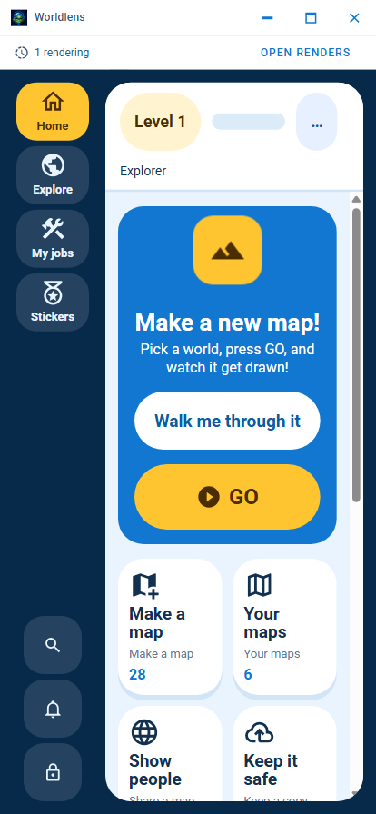

Kid Home at 414 by 896 CSS pixels, the widest of the three phone widths COMPACT_PHONE_VIEWPORTS names, alongside the 360px capture above and the 390px capture further up this section. Real Electron app with no map loaded: WORLDLENS_CAPTURE_MAP was not set, so this run had no rendered map to serve. The map area is the app's empty state, not a rendering failure. Nothing was fetched from any network. In this image, no map is loaded; the map area is the app's empty state. Captured through Chromium's DevTools surface at the exact CSS viewport, the same technique used throughout this section.

## kid-home-scale-1x

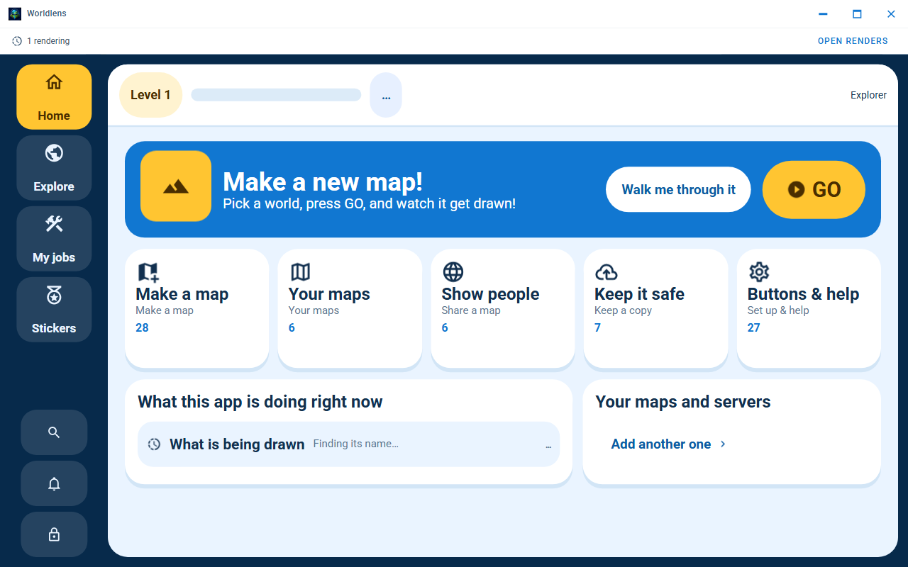

Kid Home at 100% display scale, the same SCALES matrix 'captures the shell at every supported display scale' already proves for the adult shell. Real Electron app with no map loaded: WORLDLENS_CAPTURE_MAP was not set, so this run had no rendered map to serve. The map area is the app's empty state, not a rendering failure. Nothing was fetched from any network. In this image, no map is loaded; the map area is the app's empty state.

## kid-home-scale-1_25x

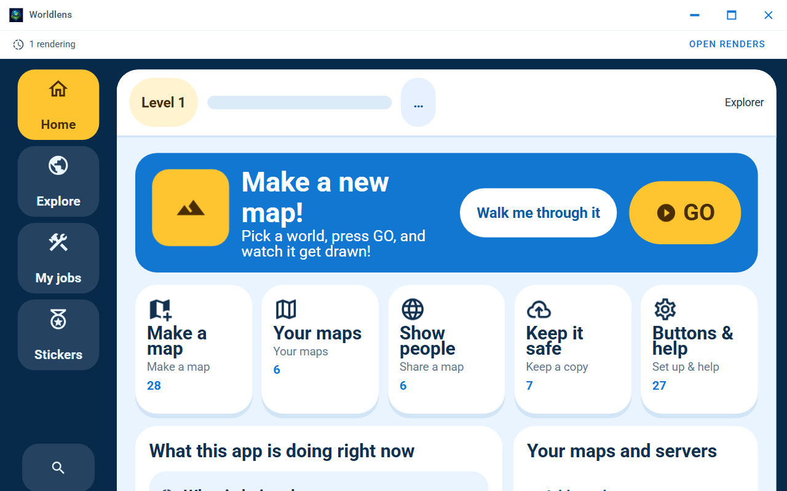

Kid Home at 125% display scale, the same SCALES matrix 'captures the shell at every supported display scale' already proves for the adult shell. Real Electron app with no map loaded: WORLDLENS_CAPTURE_MAP was not set, so this run had no rendered map to serve. The map area is the app's empty state, not a rendering failure. Nothing was fetched from any network. In this image, no map is loaded; the map area is the app's empty state.

## kid-home-scale-1_5x

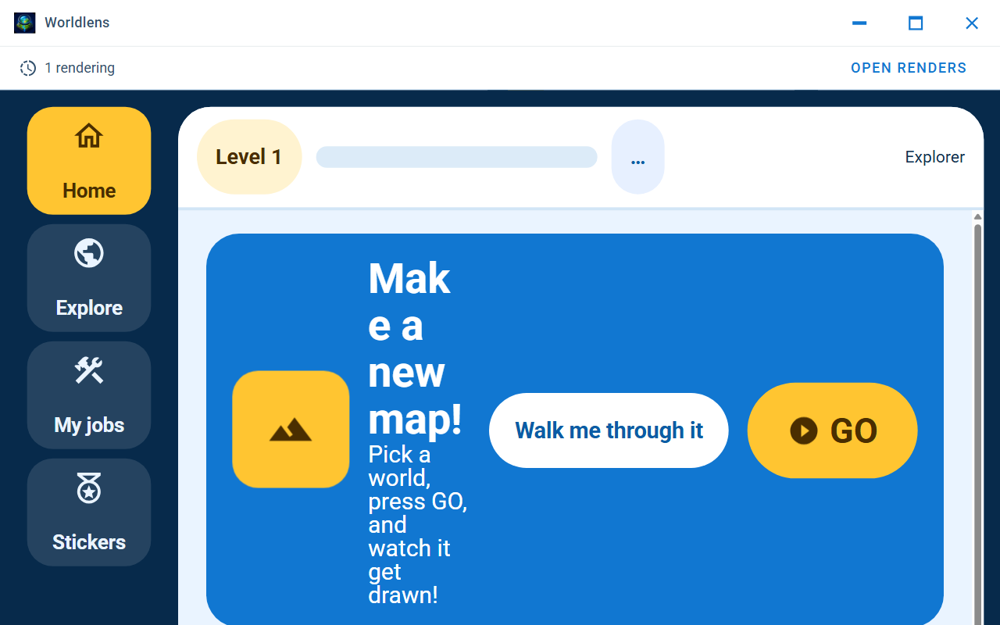

Kid Home at 150% display scale, the same SCALES matrix 'captures the shell at every supported display scale' already proves for the adult shell. Real Electron app with no map loaded: WORLDLENS_CAPTURE_MAP was not set, so this run had no rendered map to serve. The map area is the app's empty state, not a rendering failure. Nothing was fetched from any network. In this image, no map is loaded; the map area is the app's empty state.

## kid-home-scale-2x

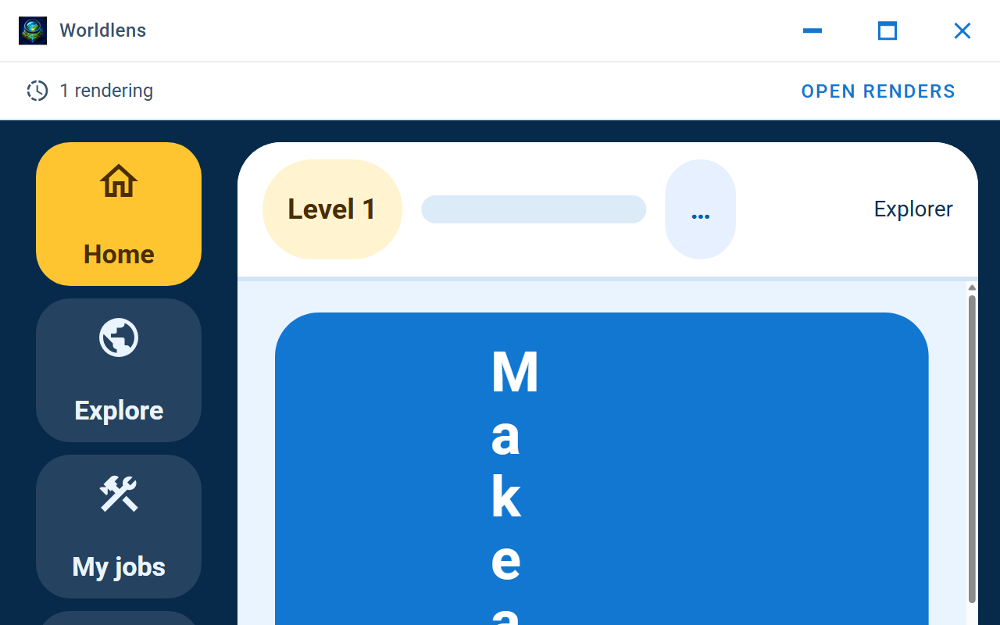

Kid Home at 200% display scale, the same SCALES matrix 'captures the shell at every supported display scale' already proves for the adult shell. Real Electron app with no map loaded: WORLDLENS_CAPTURE_MAP was not set, so this run had no rendered map to serve. The map area is the app's empty state, not a rendering failure. Nothing was fetched from any network. In this image, no map is loaded; the map area is the app's empty state.

## kid-stickers-won

![The sticker book with two of its eight stickers won and 70 XP: 'Won!' at full opacity on 'Map maker' and 'World finder', 'Not yet' and dimmed on the other six - the difference the always-empty 'Sticker book' capture above cannot show. This state was SEEDED directly into bluemap-kid-progress, the exact localStorage key useKidProgress.ts persists to and reads back on mount (JSON-parsed by that module's own defensive read(), the identical seed-then-reload mechanism every other planted value in this file uses), NOT earned through a real completion event: reaching 'first-map' for real needs the vendored Java render pipeline with an accepted Mojang download consent, and reaching 'world-finder' for real needs driving the make-a-world wizard's own guide end to end, both of which this harness avoids for the same reasons the 'Celebration' skip below gives in full. No celebration toast accompanies this picture, and none ever could from this route: KidCelebration.vue's celebrate() is called only from KidShell.vue's own award(), at the moment a real completion event fires, never derived from the ledger a component merely reads on mount - so seeding the ledger populates the book without, and could never also, stage a celebration](kid-stickers-won.png)

The sticker book with two of its eight stickers won and 70 XP: 'Won!' at full opacity on 'Map maker' and 'World finder', 'Not yet' and dimmed on the other six - the difference the always-empty 'Sticker book' capture above cannot show. This state was SEEDED directly into bluemap-kid-progress, the exact localStorage key useKidProgress.ts persists to and reads back on mount (JSON-parsed by that module's own defensive read(), the identical seed-then-reload mechanism every other planted value in this file uses), NOT earned through a real completion event: reaching 'first-map' for real needs the vendored Java render pipeline with an accepted Mojang download consent, and reaching 'world-finder' for real needs driving the make-a-world wizard's own guide end to end, both of which this harness avoids for the same reasons the 'Celebration' skip below gives in full. No celebration toast accompanies this picture, and none ever could from this route: KidCelebration.vue's celebrate() is called only from KidShell.vue's own award(), at the moment a real completion event fires, never derived from the ledger a component merely reads on mount - so seeding the ledger populates the book without, and could never also, stage a celebration. Real Electron app with no map loaded: WORLDLENS_CAPTURE_MAP was not set, so this run had no rendered map to serve. The map area is the app's empty state, not a rendering failure. Nothing was fetched from any network. In this image, no map is loaded; the map area is the app's empty state.

## Not captured

Nothing was substituted for these. They are listed so the gap is visible.

- **Rendered map**: this run served no rendered map, so no BlueMap instance exists, so the viewer's control bar is not rendered at all - and its Menu button is the only way into the side sheet this surface lives in. Set WORLDLENS_CAPTURE_MAP to a rendered web root to capture it
- **Viewer control bar**: this run served no rendered map, so no BlueMap instance exists, so the viewer's control bar is not rendered at all - and its Menu button is the only way into the side sheet this surface lives in. Set WORLDLENS_CAPTURE_MAP to a rendered web root to capture it
- **Map popup at the viewport edge**: this run has no rendered map to click
- **Menu, root page**: this run served no rendered map, so no BlueMap instance exists, so the viewer's control bar is not rendered at all - and its Menu button is the only way into the side sheet this surface lives in. Set WORLDLENS_CAPTURE_MAP to a rendered web root to capture it
- **Maps menu**: this run served no rendered map, so no BlueMap instance exists, so the viewer's control bar is not rendered at all - and its Menu button is the only way into the side sheet this surface lives in. Set WORLDLENS_CAPTURE_MAP to a rendered web root to capture it
- **Settings menu**: this run served no rendered map, so no BlueMap instance exists, so the viewer's control bar is not rendered at all - and its Menu button is the only way into the side sheet this surface lives in. Set WORLDLENS_CAPTURE_MAP to a rendered web root to capture it
- **Info page**: this run served no rendered map, so no BlueMap instance exists, so the viewer's control bar is not rendered at all - and its Menu button is the only way into the side sheet this surface lives in. Set WORLDLENS_CAPTURE_MAP to a rendered web root to capture it
- **Marker menu**: this run served no rendered map, so no BlueMap instance exists, so the viewer's control bar is not rendered at all - and its Menu button is the only way into the side sheet this surface lives in. Set WORLDLENS_CAPTURE_MAP to a rendered web root to capture it
- **Marker studio**: this run served no rendered map, so no BlueMap instance exists, so the viewer's control bar is not rendered at all - and its Menu button is the only way into the side sheet this surface lives in. Set WORLDLENS_CAPTURE_MAP to a rendered web root to capture it
- **Menu search bar**: this run served no rendered map, so no BlueMap instance exists, so the viewer's control bar is not rendered at all - and its Menu button is the only way into the side sheet this surface lives in. Set WORLDLENS_CAPTURE_MAP to a rendered web root to capture it
- **Reset settings super confirmation**: this run served no rendered map, so no BlueMap instance exists, so the viewer's control bar is not rendered at all - and its Menu button is the only way into the side sheet this surface lives in. Set WORLDLENS_CAPTURE_MAP to a rendered web root to capture it
- **Marker search and sort controls**: this run served no rendered map, so no BlueMap instance exists, so the viewer's control bar is not rendered at all - and its Menu button is the only way into the side sheet this surface lives in. Set WORLDLENS_CAPTURE_MAP to a rendered web root to capture it
- **GitHub account, signed in**: signing in needs a real GitHub account and a real device-flow round trip to github.com, and the offline guard refuses every request that is not loopback; the signed-out state of the account section is real and is the one captured
- **Options editor save plan**: the Save control is disabled in this state, and its tooltip says why; the dialog that lists the files a save would write therefore has no door to open through, and nothing was substituted for it
- **Remote hosting panel**: the harness could not open it in this run: locator.waitFor: Timeout 45000ms exceeded. (the whole failure is in diagnostic-remote-hosting-panel.txt, beside the images)
- **Render console**: the console exists only while a render is genuinely in flight, and this run has none: starting one needs a Java runtime, an accepted Mojang download consent (declined here, deliberately) and minutes of work. Nothing was substituted
- **Changelog viewer**: this run served no rendered map, so no BlueMap instance exists, so the viewer's control bar is not rendered at all - and its Menu button is the only way into the side sheet this surface lives in. Set WORLDLENS_CAPTURE_MAP to a rendered web root to capture it
- **Release asset list and download progress**: listing a release's assets and downloading one both need real traffic to github.com, which the offline guard refuses; the panel is captured in the state it is in before anything has been asked for
- **Render progress panel**: it only exists while a render is actually running, which needs a Java runtime, an accepted Mojang download consent and minutes of work; this run declined that consent
- **Interrupted renders**: it only appears when a previous render was interrupted and left a session behind, and the throwaway profile this run used has never started one
- **Grown-up gate, credential configured**: reaching this state needs a real shared restricted-mode credential, and that record is deliberately not scoped to this run's throwaway --user-data-dir: SchoolModeStore (design/packages/app/src/main/schoolMode/record.ts) writes it to <app.getPath('appData')>/Ding-Ding Shared/school-mode.v1.json, a location shared on purpose across every Kid-Mode-capable app on the host. Setting one here to capture this state would write that file to this machine's real, persistent application-data directory rather than to the disposable profile the rest of this harness confines itself to - the same trade this file's own 'captures the reset-settings super confirmation' test already declines for a strictly weaker case (a slider armed and then backed out of with Emergency exit, because completing it 'really does reset every setting ... and a capture is not worth doing that', even though that slider's own blast radius is the throwaway profile alone). See this test's own comment immediately above for the full reasoning, including why this is a genuine architecture fact rather than a fixed harness limitation
- **Grown-up gate, wrong-code refusal**: a sub-state of the credentialed branch the 'Grown-up gate, credential configured' skip above already declines to reach on this host, for the identical reason given there in full: the shared restricted-mode credential a wrong code would be checked against is not scoped to this run's throwaway --user-data-dir, so there is no credentialed branch on this host for a wrong code to be typed into in the first place. Reachable safely in CI, where the ephemeral runner's own $HOME makes both this and the credentialed branch above genuinely safe to seed
- **Kid Mode theme variants (light/dark/contrast)**: Kid Mode always paints from its own fixed 'kid' Vuetify theme (KID_SCHEME in kidTheme.ts) rather than the light/dark/contrast scheme chosen in Adult Mode's own Settings - App.vue's own watcher snaps the live theme name straight back to 'kid' the instant Kid Mode is active, so there is no separate light/dark/contrast variant of any Kid Mode surface to capture. Not a harness limitation: there is genuinely nothing else to capture here, and the note on the 'Kid Home' capture above says the same thing at the point a reader is most likely to be asking why no kid-theme-* pair sits beside theme-light.png/theme-dark.png
- **Celebration**: KidCelebration.vue only ever fires from a real completion event forwarded through App.vue's awardKidSticker() - a rendered map opened, a page published to GitHub Pages, a local render finished, or the guide finding a world (App.vue's own doc comment on that function: 'every caller below this point is a real action finishing, never a fabricated signal'). Every one of those needs either the vendored Java render pipeline with an accepted Mojang download consent and minutes of work (the same reason 'Render progress panel' above is unreachable) or a signed-in GitHub account (the same reason 'GitHub account, signed in' above is unreachable). Calling useKidProgress().award() directly from this harness, bypassing awardKidSticker's real trigger, would be exactly the staging this file's own header rules out for every surface: 'no value is planted to make a screen look populated, and no screen stands in for a different one'

