# Screenshots

Commit `be70670721f7089e418b4b58ccfee9839a6f8ab4`, run `local cheap-headless: 25/25 full + 1/1 onboarding supplement`, capture mode `local`.

Real Electron app. The map was rendered by upstream BlueMap's Java engine from a world this repository generated, and is served to the app over loopback by this repository's own map handler. What it proves is the viewer port, the embedded server and the reverse proxy. The TypeScript mesher in packages/engine rendered none of it.

## firstrun-1-welcome-window

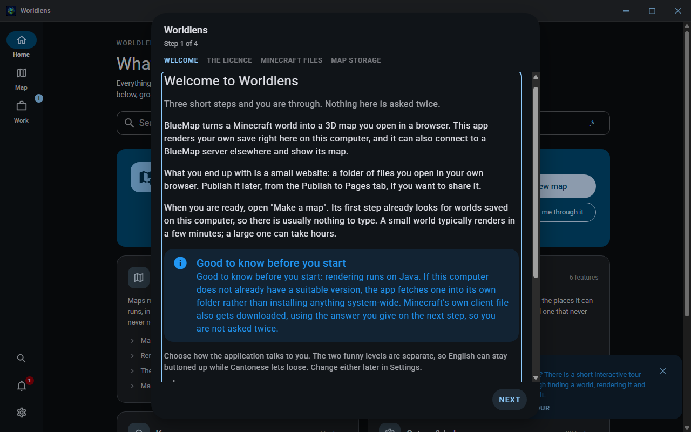

First-run setup as it appears over the whole application window on a fresh profile. Real Electron app. The map was rendered by upstream BlueMap's Java engine from a world this repository generated, and is served to the app over loopback by this repository's own map handler. What it proves is the viewer port, the embedded server and the reverse proxy. The TypeScript mesher in packages/engine rendered none of it. In this image, the map had drawn nothing when this was taken, so the map area is empty.

## firstrun-1-welcome

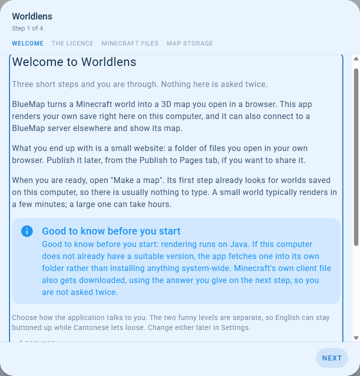

First-run setup, the welcome step, with the three language modes and a separate funny level for each language. Real Electron app. The map was rendered by upstream BlueMap's Java engine from a world this repository generated, and is served to the app over loopback by this repository's own map handler. What it proves is the viewer port, the embedded server and the reverse proxy. The TypeScript mesher in packages/engine rendered none of it. This image is cropped to the first-run dialog rather than showing the whole window.

## firstrun-2-consent

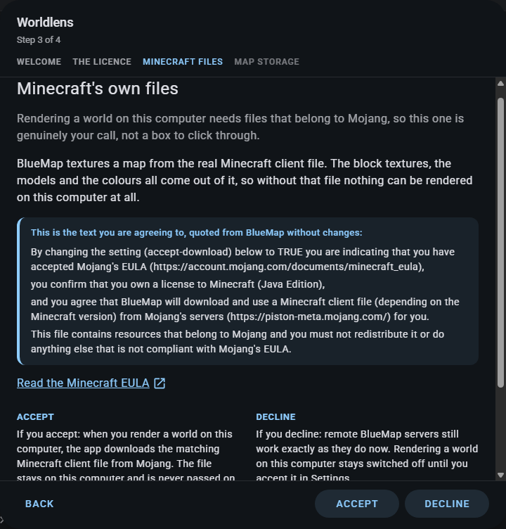

First-run setup, the Minecraft files step, which asks once whether the application may download from Mojang and says what each answer means. Real Electron app. The map was rendered by upstream BlueMap's Java engine from a world this repository generated, and is served to the app over loopback by this repository's own map handler. What it proves is the viewer port, the embedded server and the reverse proxy. The TypeScript mesher in packages/engine rendered none of it. This image is cropped to the first-run dialog rather than showing the whole window.

## firstrun-2-eula

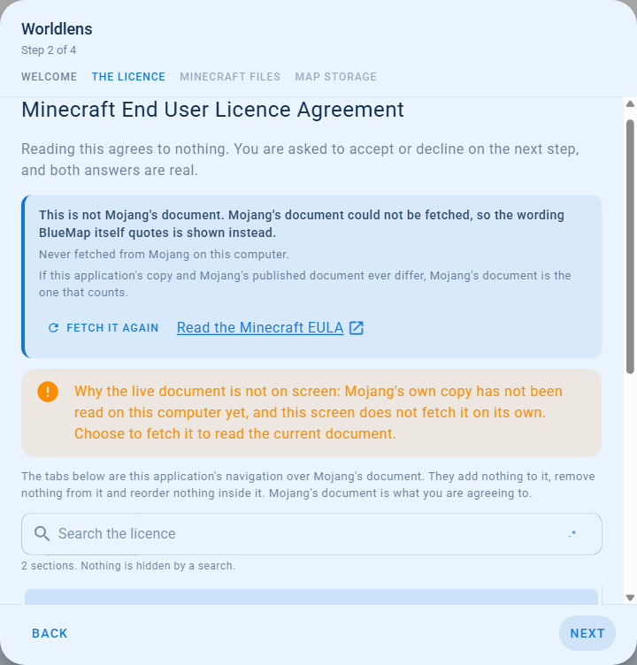

First-run setup, the Minecraft licence step, with the document provenance and its anchored search. Real Electron app. The map was rendered by upstream BlueMap's Java engine from a world this repository generated, and is served to the app over loopback by this repository's own map handler. What it proves is the viewer port, the embedded server and the reverse proxy. The TypeScript mesher in packages/engine rendered none of it. This image is cropped to the first-run dialog rather than showing the whole window.

## firstrun-3-storage

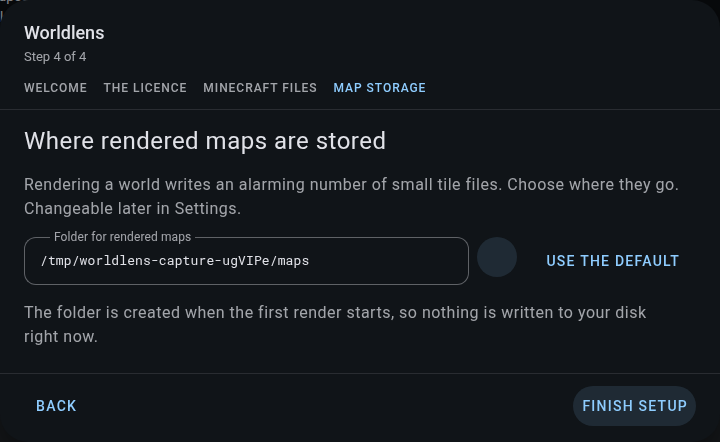

First-run setup, the map storage step, which asks where rendered maps should be written. Real Electron app. The map was rendered by upstream BlueMap's Java engine from a world this repository generated, and is served to the app over loopback by this repository's own map handler. What it proves is the viewer port, the embedded server and the reverse proxy. The TypeScript mesher in packages/engine rendered none of it. This image is cropped to the first-run dialog rather than showing the whole window.

## run-location

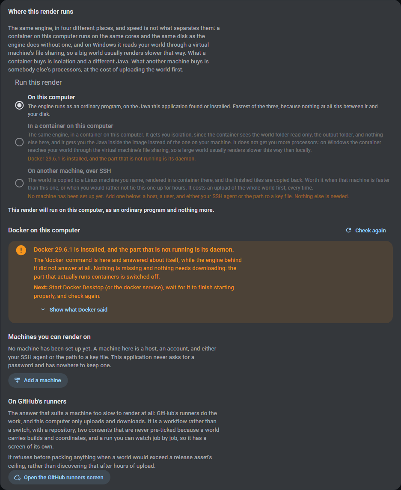

The render-location choice: local, Docker on this computer, and another machine over SSH, with Docker's real daemon state and the route that will actually be used. Real Electron app. The map was rendered by upstream BlueMap's Java engine from a world this repository generated, and is served to the app over loopback by this repository's own map handler. What it proves is the viewer port, the embedded server and the reverse proxy. The TypeScript mesher in packages/engine rendered none of it. This image is cropped to the render-location card rather than showing the whole window.

## chrome-titlebar

The application's own Material title bar, the whole width of the window, with no operating system caption bar above it. Real Electron app. The map was rendered by upstream BlueMap's Java engine from a world this repository generated, and is served to the app over loopback by this repository's own map handler. What it proves is the viewer port, the embedded server and the reverse proxy. The TypeScript mesher in packages/engine rendered none of it. This image is cropped to the title bar rather than showing the whole window.

## chrome-titlebar-window-buttons

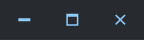

The minimize, maximize and close buttons the application draws for itself, because the window is frameless. Real Electron app. The map was rendered by upstream BlueMap's Java engine from a world this repository generated, and is served to the app over loopback by this repository's own map handler. What it proves is the viewer port, the embedded server and the reverse proxy. The TypeScript mesher in packages/engine rendered none of it. This image is cropped to the window buttons rather than showing the whole window.

## chrome-control-bar

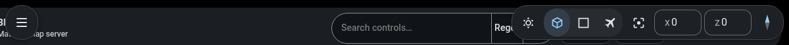

The viewer control bar: the menu button, the map, marker and player lists, the view and day-night switches, the live position inputs and the compass. Real Electron app. The map was rendered by upstream BlueMap's Java engine from a world this repository generated, and is served to the app over loopback by this repository's own map handler. What it proves is the viewer port, the embedded server and the reverse proxy. The TypeScript mesher in packages/engine rendered none of it. This image is cropped to the control bar rather than showing the whole window.

## chrome-shell-buttons

The three shell buttons in the bottom left corner: settings, maps and servers, and server configuration. Real Electron app. The map was rendered by upstream BlueMap's Java engine from a world this repository generated, and is served to the app over loopback by this repository's own map handler. What it proves is the viewer port, the embedded server and the reverse proxy. The TypeScript mesher in packages/engine rendered none of it. This image is cropped to the shell buttons rather than showing the whole window.

## shell-1280x800

The application shell at 1280x800. Real Electron app. The map was rendered by upstream BlueMap's Java engine from a world this repository generated, and is served to the app over loopback by this repository's own map handler. What it proves is the viewer port, the embedded server and the reverse proxy. The TypeScript mesher in packages/engine rendered none of it. In this image, the map area shows the locally rendered world named above.

## shell-1920x1080

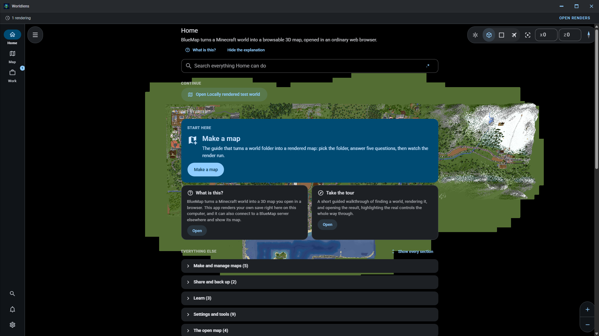

The application shell at 1920x1080. Real Electron app. The map was rendered by upstream BlueMap's Java engine from a world this repository generated, and is served to the app over loopback by this repository's own map handler. What it proves is the viewer port, the embedded server and the reverse proxy. The TypeScript mesher in packages/engine rendered none of it. In this image, the map area shows the locally rendered world named above.

## shell-1024x768

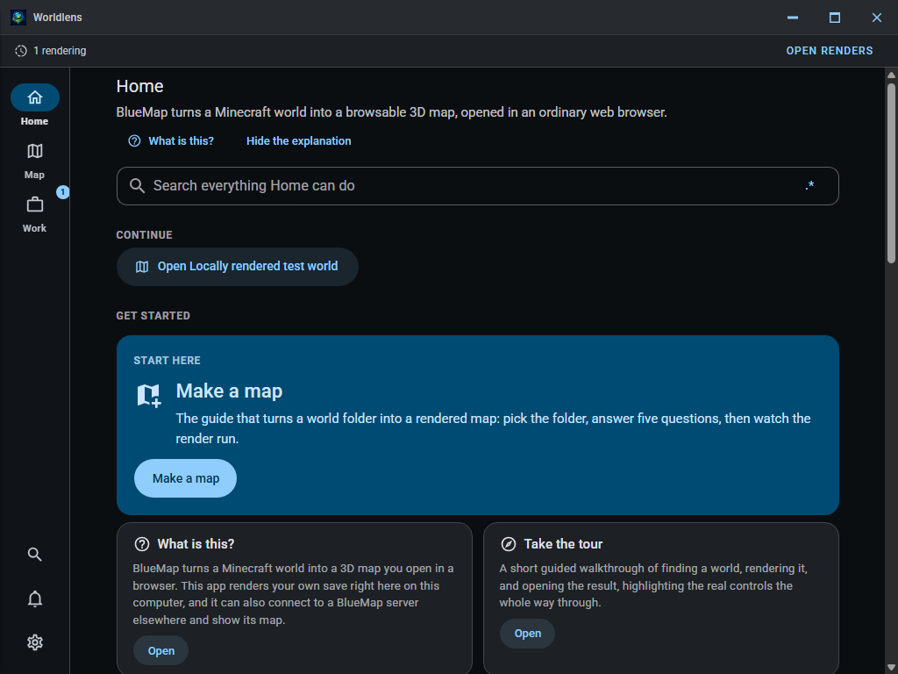

The application shell at 1024x768. Real Electron app. The map was rendered by upstream BlueMap's Java engine from a world this repository generated, and is served to the app over loopback by this repository's own map handler. What it proves is the viewer port, the embedded server and the reverse proxy. The TypeScript mesher in packages/engine rendered none of it. In this image, the map area shows the locally rendered world named above.

## shell-800x600-narrow

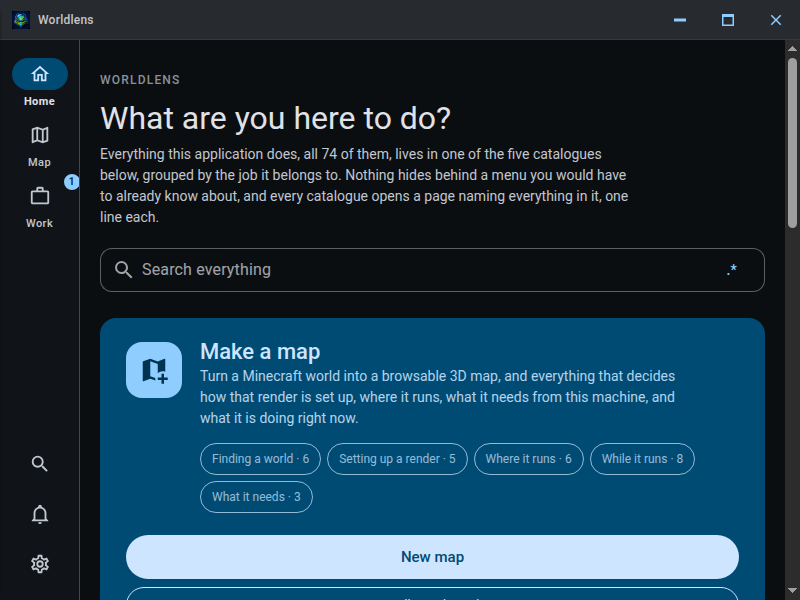

The application shell at 800x600-narrow. Real Electron app. The map was rendered by upstream BlueMap's Java engine from a world this repository generated, and is served to the app over loopback by this repository's own map handler. What it proves is the viewer port, the embedded server and the reverse proxy. The TypeScript mesher in packages/engine rendered none of it. In this image, the map area shows the locally rendered world named above.

## shell-scale-1x

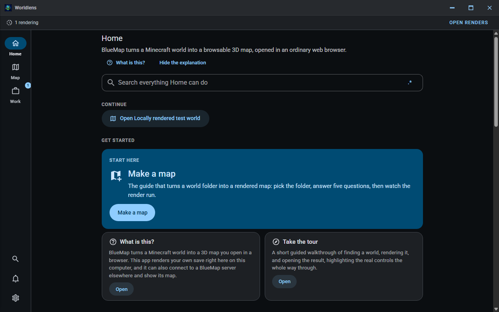

The application shell at 100% display scale. Real Electron app. The map was rendered by upstream BlueMap's Java engine from a world this repository generated, and is served to the app over loopback by this repository's own map handler. What it proves is the viewer port, the embedded server and the reverse proxy. The TypeScript mesher in packages/engine rendered none of it. In this image, the map area shows the locally rendered world named above.

## shell-scale-1_25x

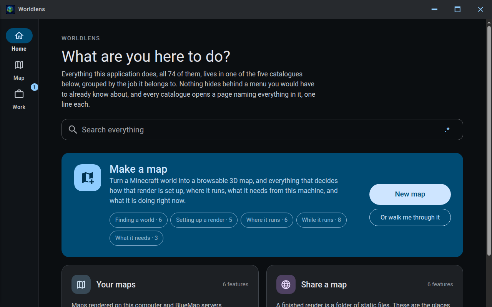

The application shell at 125% display scale. Real Electron app. The map was rendered by upstream BlueMap's Java engine from a world this repository generated, and is served to the app over loopback by this repository's own map handler. What it proves is the viewer port, the embedded server and the reverse proxy. The TypeScript mesher in packages/engine rendered none of it. In this image, the map area shows the locally rendered world named above.

## shell-scale-1_5x

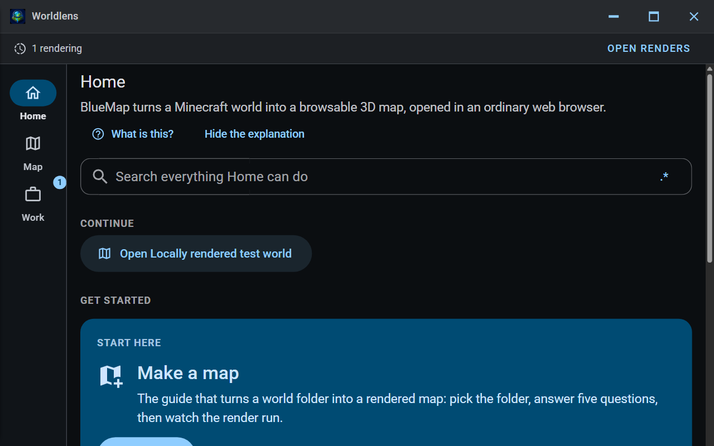

The application shell at 150% display scale. Real Electron app. The map was rendered by upstream BlueMap's Java engine from a world this repository generated, and is served to the app over loopback by this repository's own map handler. What it proves is the viewer port, the embedded server and the reverse proxy. The TypeScript mesher in packages/engine rendered none of it. In this image, the map area shows the locally rendered world named above.

## shell-scale-2x

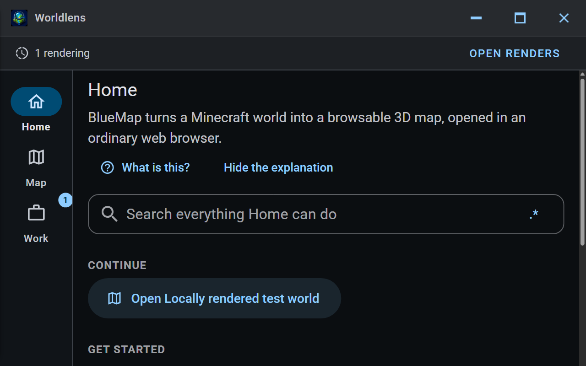

The application shell at 200% display scale. Real Electron app. The map was rendered by upstream BlueMap's Java engine from a world this repository generated, and is served to the app over loopback by this repository's own map handler. What it proves is the viewer port, the embedded server and the reverse proxy. The TypeScript mesher in packages/engine rendered none of it. In this image, the map area shows the locally rendered world named above.

## issue-105-popup-edge

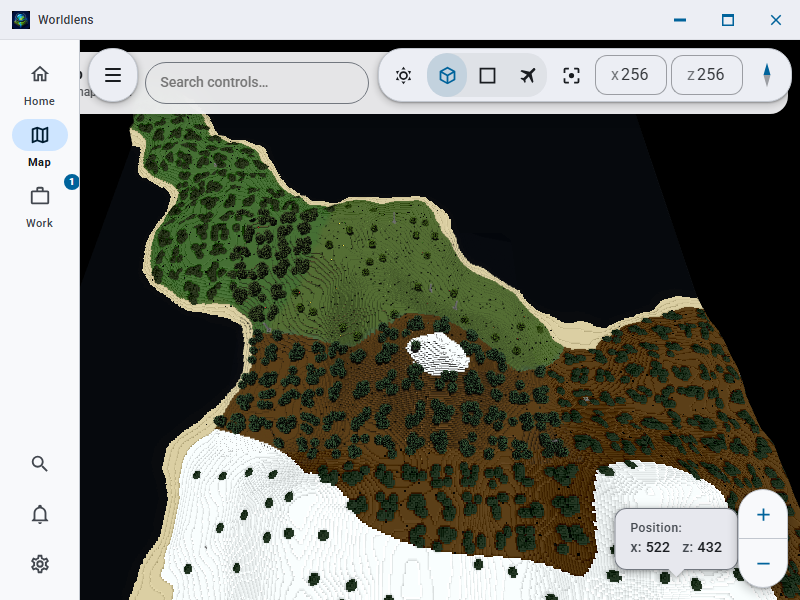

The block-coordinate popup opened from a real map click near the lower-right viewport edge, with every coordinate row retained inside the map. Real Electron app. The map was rendered by upstream BlueMap's Java engine from a world this repository generated, and is served to the app over loopback by this repository's own map handler. What it proves is the viewer port, the embedded server and the reverse proxy. The TypeScript mesher in packages/engine rendered none of it. In this image, the map area shows the locally rendered world named above. Measured popup 139×62 pixels inside CSS2D bounds 800×560 pixels.

## theme-light

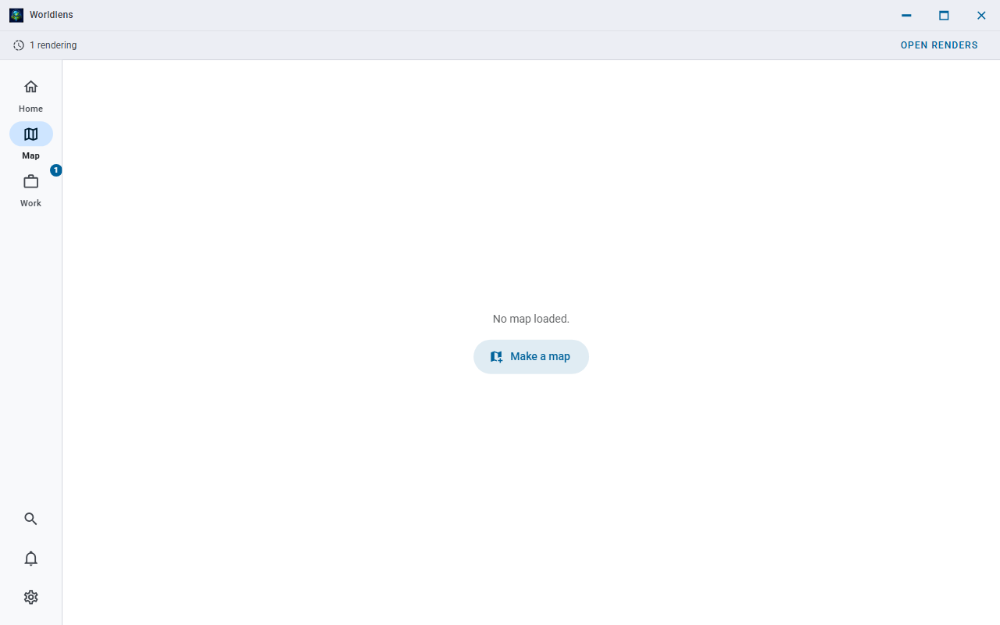

The application shell in the light theme. Real Electron app. The map was rendered by upstream BlueMap's Java engine from a world this repository generated, and is served to the app over loopback by this repository's own map handler. What it proves is the viewer port, the embedded server and the reverse proxy. The TypeScript mesher in packages/engine rendered none of it. In this image, the map area shows the locally rendered world named above.

## theme-dark

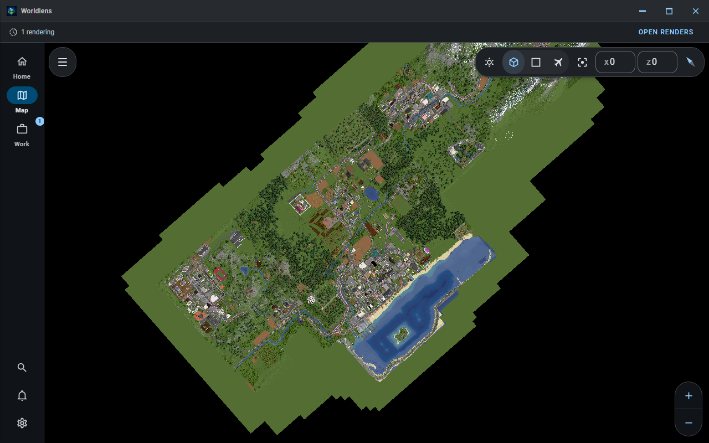

The application shell in the dark theme. Real Electron app. The map was rendered by upstream BlueMap's Java engine from a world this repository generated, and is served to the app over loopback by this repository's own map handler. What it proves is the viewer port, the embedded server and the reverse proxy. The TypeScript mesher in packages/engine rendered none of it. In this image, the map area shows the locally rendered world named above.

## menu-root

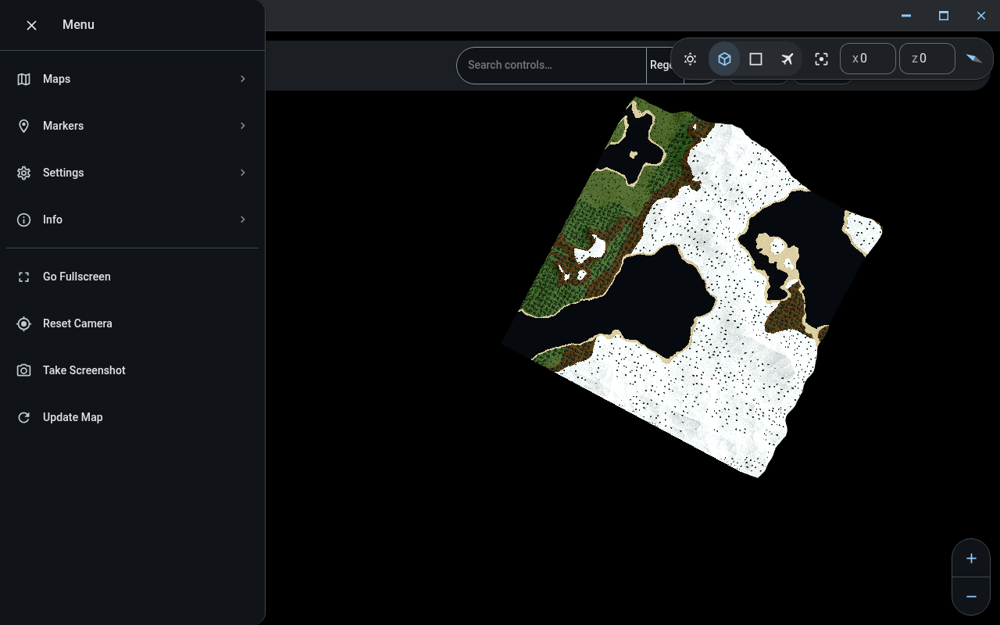

The main menu, listing maps, markers, settings and info, then the camera and screenshot actions. Real Electron app. The map was rendered by upstream BlueMap's Java engine from a world this repository generated, and is served to the app over loopback by this repository's own map handler. What it proves is the viewer port, the embedded server and the reverse proxy. The TypeScript mesher in packages/engine rendered none of it. In this image, the map area shows the locally rendered world named above.

## menu-maps

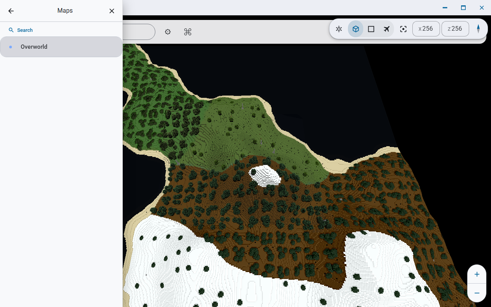

The maps menu, listing the maps the active profile serves. Real Electron app. The map was rendered by upstream BlueMap's Java engine from a world this repository generated, and is served to the app over loopback by this repository's own map handler. What it proves is the viewer port, the embedded server and the reverse proxy. The TypeScript mesher in packages/engine rendered none of it. In this image, the map area shows the locally rendered world named above.

## menu-settings

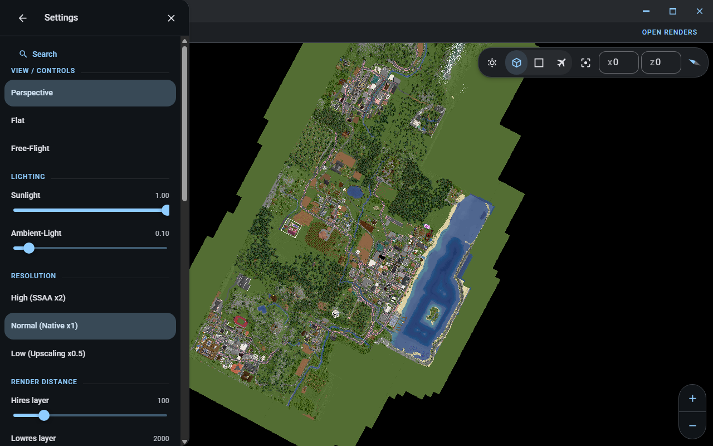

The viewer settings menu inside the side sheet, with its own search bar at the top. Real Electron app. The map was rendered by upstream BlueMap's Java engine from a world this repository generated, and is served to the app over loopback by this repository's own map handler. What it proves is the viewer port, the embedded server and the reverse proxy. The TypeScript mesher in packages/engine rendered none of it. In this image, the map area shows the locally rendered world named above.

## menu-info

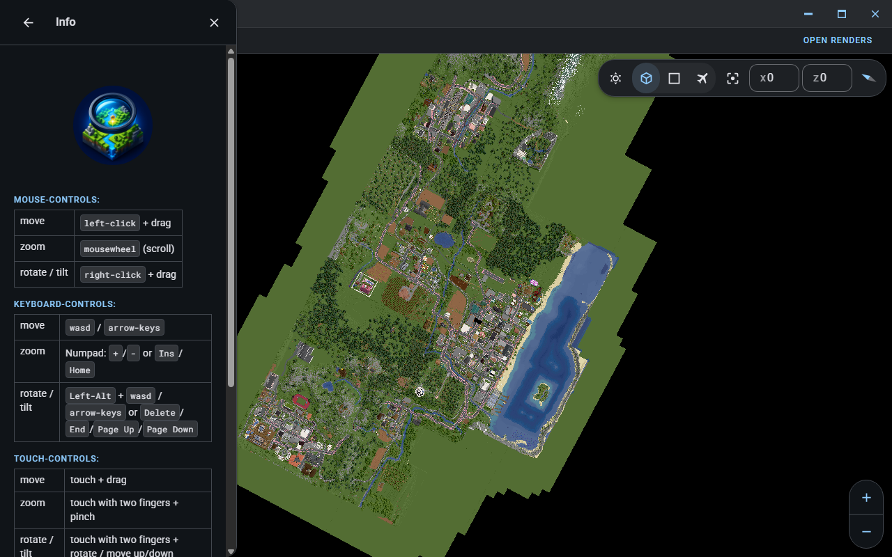

The info page, with the application version at the foot of it. Real Electron app. The map was rendered by upstream BlueMap's Java engine from a world this repository generated, and is served to the app over loopback by this repository's own map handler. What it proves is the viewer port, the embedded server and the reverse proxy. The TypeScript mesher in packages/engine rendered none of it. In this image, the map area shows the locally rendered world named above.

## menu-markers

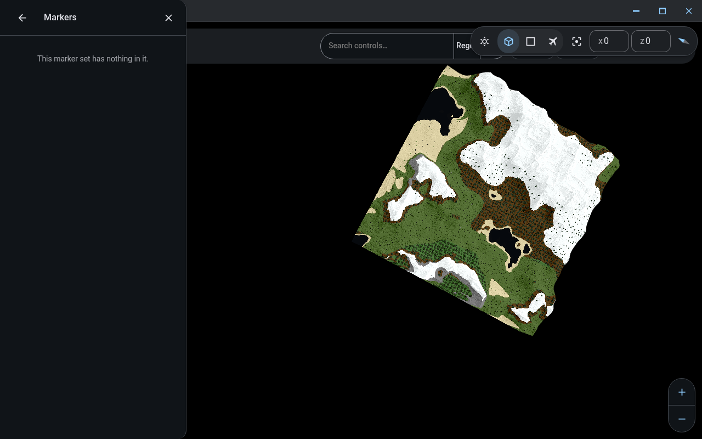

The marker menu, showing the marker sets of the map that is loaded. Real Electron app. The map was rendered by upstream BlueMap's Java engine from a world this repository generated, and is served to the app over loopback by this repository's own map handler. What it proves is the viewer port, the embedded server and the reverse proxy. The TypeScript mesher in packages/engine rendered none of it. In this image, the map area shows the locally rendered world named above.

## menu-search

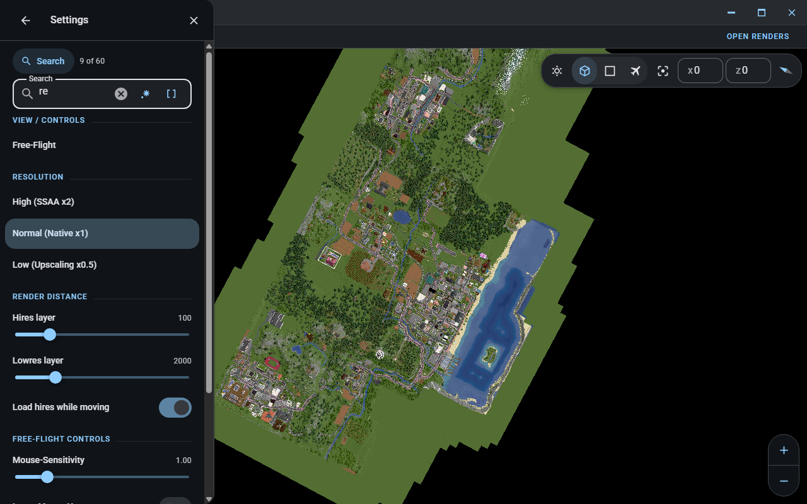

The settings menu's own search bar, filtering the menu down to the settings that match what was typed. Real Electron app. The map was rendered by upstream BlueMap's Java engine from a world this repository generated, and is served to the app over loopback by this repository's own map handler. What it proves is the viewer port, the embedded server and the reverse proxy. The TypeScript mesher in packages/engine rendered none of it. In this image, the map area shows the locally rendered world named above.

## menu-regex-builder

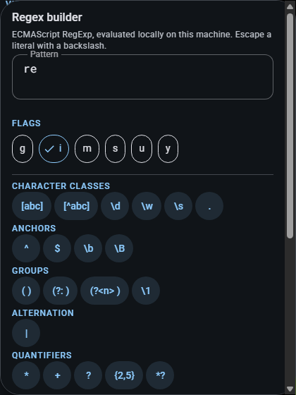

The regex builder anchored to the menu's search bar, with its flags, its character classes, anchors, groups, alternation and quantifiers, and the live matches underneath. Real Electron app. The map was rendered by upstream BlueMap's Java engine from a world this repository generated, and is served to the app over loopback by this repository's own map handler. What it proves is the viewer port, the embedded server and the reverse proxy. The TypeScript mesher in packages/engine rendered none of it. This image is cropped to the regex builder rather than showing the whole window.

## super-confirm-untouched

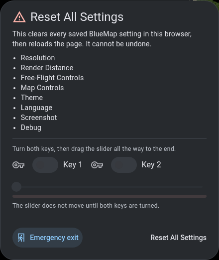

The destructive-action gate before either key is turned: the slider will not move, and the status line says both keys are needed. Real Electron app. The map was rendered by upstream BlueMap's Java engine from a world this repository generated, and is served to the app over loopback by this repository's own map handler. What it proves is the viewer port, the embedded server and the reverse proxy. The TypeScript mesher in packages/engine rendered none of it. This image is cropped to the confirmation dialog rather than showing the whole window.

## super-confirm-one-key

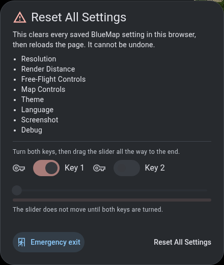

The destructive-action gate with one key turned, which is still not enough to arm the slider. Real Electron app. The map was rendered by upstream BlueMap's Java engine from a world this repository generated, and is served to the app over loopback by this repository's own map handler. What it proves is the viewer port, the embedded server and the reverse proxy. The TypeScript mesher in packages/engine rendered none of it. This image is cropped to the confirmation dialog rather than showing the whole window.

## super-confirm-armed

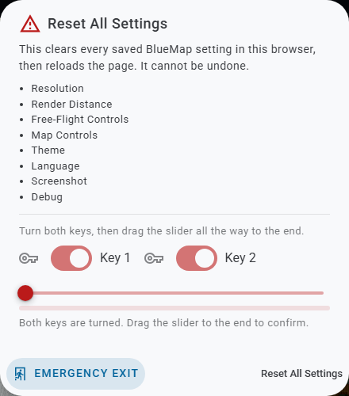

The destructive-action gate with both keys turned and the slider armed, one full drag away from resetting every viewer setting. Real Electron app. The map was rendered by upstream BlueMap's Java engine from a world this repository generated, and is served to the app over loopback by this repository's own map handler. What it proves is the viewer port, the embedded server and the reverse proxy. The TypeScript mesher in packages/engine rendered none of it. This image is cropped to the confirmation dialog rather than showing the whole window.

## profiles-manager

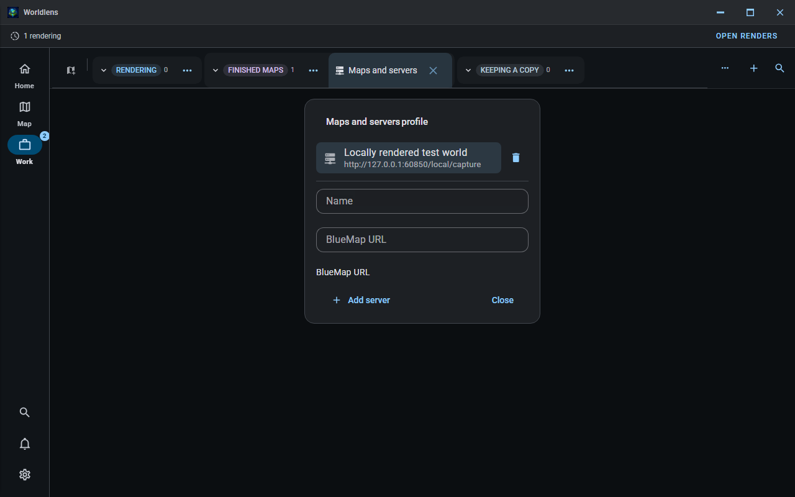

The maps and servers manager on its own tab, listing the maps rendered on this computer and the remote BlueMap servers the application knows about, with the fields for adding another. Real Electron app. The map was rendered by upstream BlueMap's Java engine from a world this repository generated, and is served to the app over loopback by this repository's own map handler. What it proves is the viewer port, the embedded server and the reverse proxy. The TypeScript mesher in packages/engine rendered none of it. In this image, an opaque surface fills the window, so none of the map behind it is visible.

## backups

Backing a world or a rendered map up to GitHub release assets: what to pack, where it goes, and the notice saying nobody is signed in to GitHub on this computer yet. The screen states why this uses release assets rather than Git LFS, and the pointer format it writes. Real Electron app. The map was rendered by upstream BlueMap's Java engine from a world this repository generated, and is served to the app over loopback by this repository's own map handler. What it proves is the viewer port, the embedded server and the reverse proxy. The TypeScript mesher in packages/engine rendered none of it. In this image, an opaque surface fills the window, so none of the map behind it is visible.

## settings-drawer

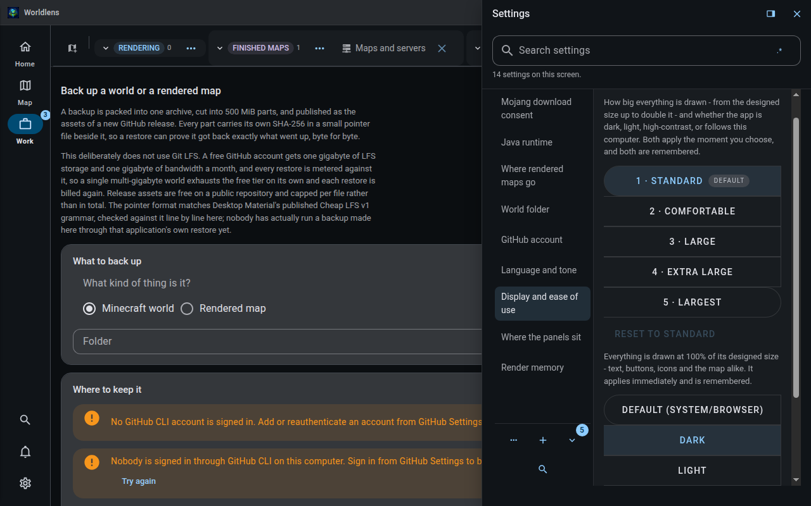

The application settings, opened over the map. Real Electron app. The map was rendered by upstream BlueMap's Java engine from a world this repository generated, and is served to the app over loopback by this repository's own map handler. What it proves is the viewer port, the embedded server and the reverse proxy. The TypeScript mesher in packages/engine rendered none of it. In this image, the map area shows the locally rendered world named above.

## settings-section-mojang-download-consent

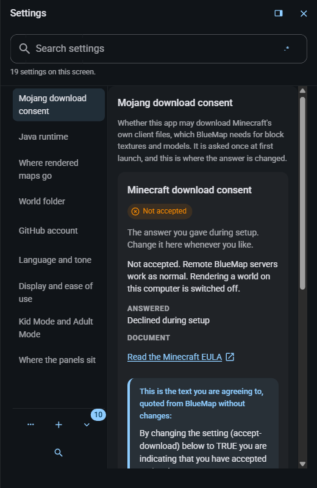

The "Mojang download consent" settings section, scrolled into view in the settings drawer. Real Electron app. The map was rendered by upstream BlueMap's Java engine from a world this repository generated, and is served to the app over loopback by this repository's own map handler. What it proves is the viewer port, the embedded server and the reverse proxy. The TypeScript mesher in packages/engine rendered none of it. This image is cropped to the settings drawer rather than showing the whole window.

## settings-section-java-runtime

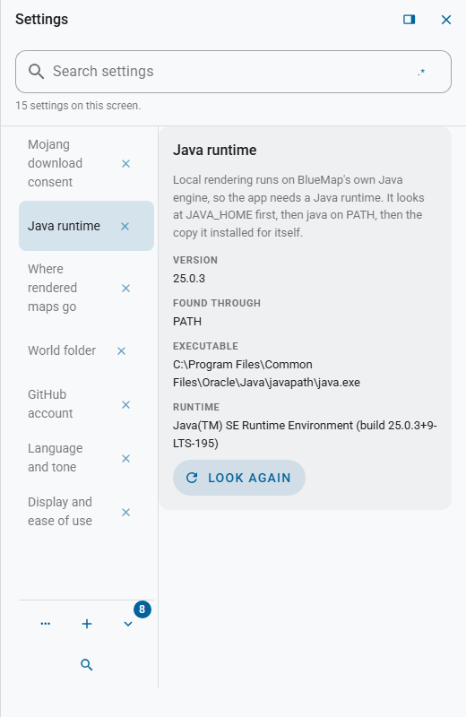

The "Java runtime" settings section, scrolled into view in the settings drawer. Real Electron app. The map was rendered by upstream BlueMap's Java engine from a world this repository generated, and is served to the app over loopback by this repository's own map handler. What it proves is the viewer port, the embedded server and the reverse proxy. The TypeScript mesher in packages/engine rendered none of it. This image is cropped to the settings drawer rather than showing the whole window.

## settings-section-map-storage-directory

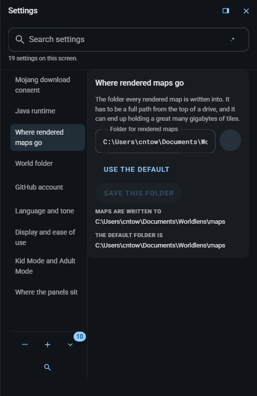

The "Where rendered maps go" settings section, scrolled into view in the settings drawer. Real Electron app. The map was rendered by upstream BlueMap's Java engine from a world this repository generated, and is served to the app over loopback by this repository's own map handler. What it proves is the viewer port, the embedded server and the reverse proxy. The TypeScript mesher in packages/engine rendered none of it. This image is cropped to the settings drawer rather than showing the whole window.

## settings-section-world-folder

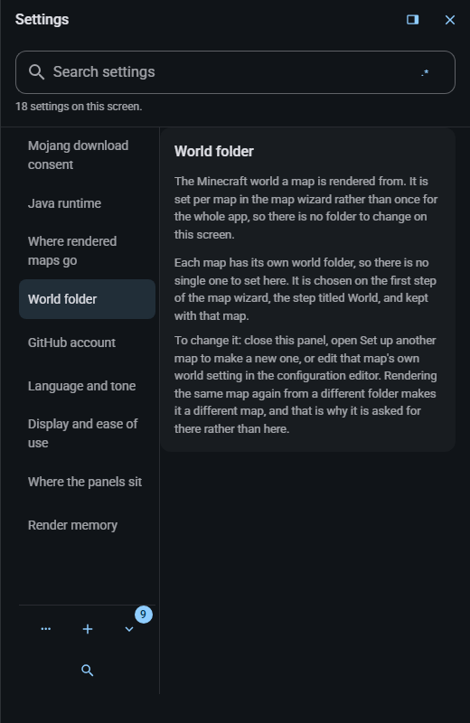

The "World folder" settings section, scrolled into view in the settings drawer. Real Electron app. The map was rendered by upstream BlueMap's Java engine from a world this repository generated, and is served to the app over loopback by this repository's own map handler. What it proves is the viewer port, the embedded server and the reverse proxy. The TypeScript mesher in packages/engine rendered none of it. This image is cropped to the settings drawer rather than showing the whole window.

## settings-section-github-account

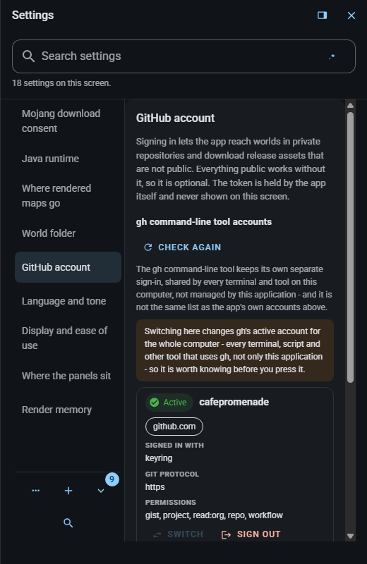

The "GitHub account" settings section, scrolled into view in the settings drawer. Real Electron app. The map was rendered by upstream BlueMap's Java engine from a world this repository generated, and is served to the app over loopback by this repository's own map handler. What it proves is the viewer port, the embedded server and the reverse proxy. The TypeScript mesher in packages/engine rendered none of it. This image is cropped to the settings drawer rather than showing the whole window.

## settings-section-language-and-tone

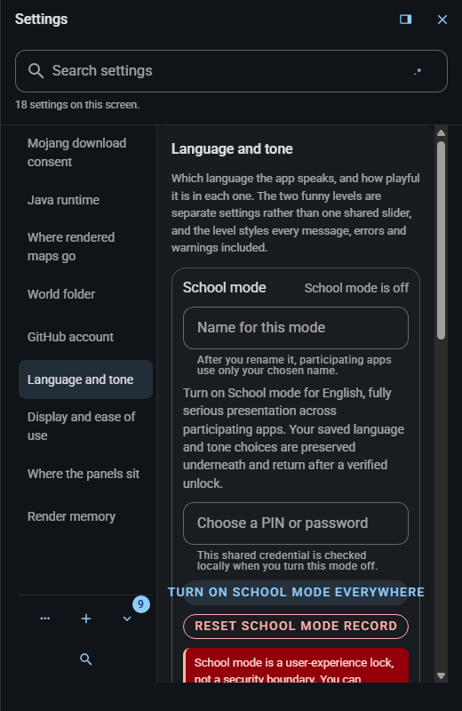

The "Language and tone" settings section, scrolled into view in the settings drawer. Real Electron app. The map was rendered by upstream BlueMap's Java engine from a world this repository generated, and is served to the app over loopback by this repository's own map handler. What it proves is the viewer port, the embedded server and the reverse proxy. The TypeScript mesher in packages/engine rendered none of it. This image is cropped to the settings drawer rather than showing the whole window.

## settings-search

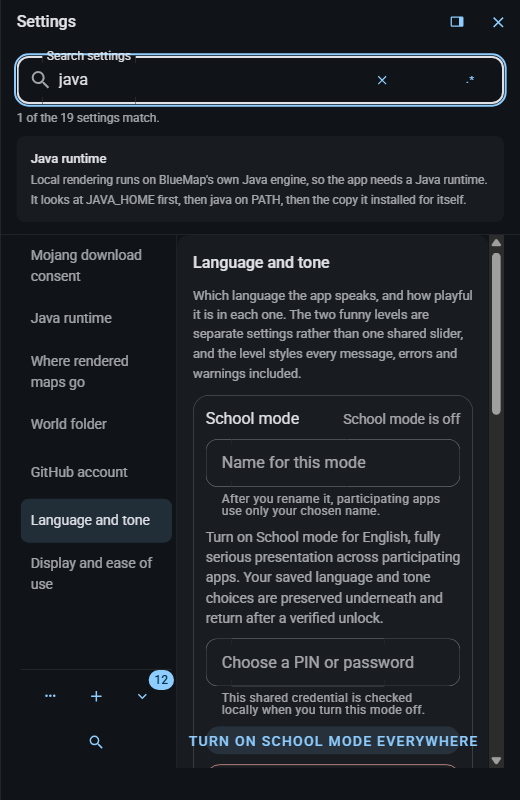

The settings search, filtering the drawer to the settings whose name, explanation or current value matches what was typed. Real Electron app. The map was rendered by upstream BlueMap's Java engine from a world this repository generated, and is served to the app over loopback by this repository's own map handler. What it proves is the viewer port, the embedded server and the reverse proxy. The TypeScript mesher in packages/engine rendered none of it. This image is cropped to the settings drawer rather than showing the whole window.

## settings-regex-builder

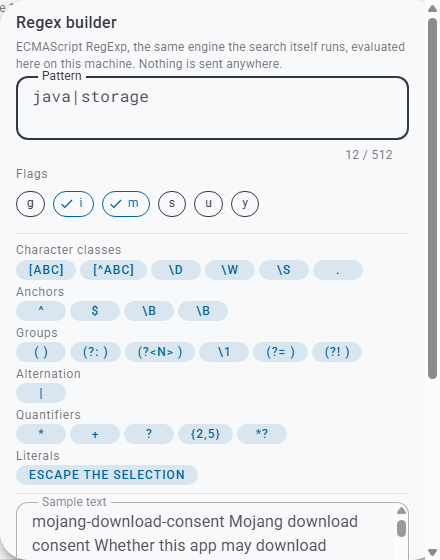

The regex builder anchored to the settings search, showing the pattern, the supported flags, the guided token palette and the live matches against the text on screen. Real Electron app. The map was rendered by upstream BlueMap's Java engine from a world this repository generated, and is served to the app over loopback by this repository's own map handler. What it proves is the viewer port, the embedded server and the reverse proxy. The TypeScript mesher in packages/engine rendered none of it. This image is cropped to the regex builder rather than showing the whole window.

## notifications-toast

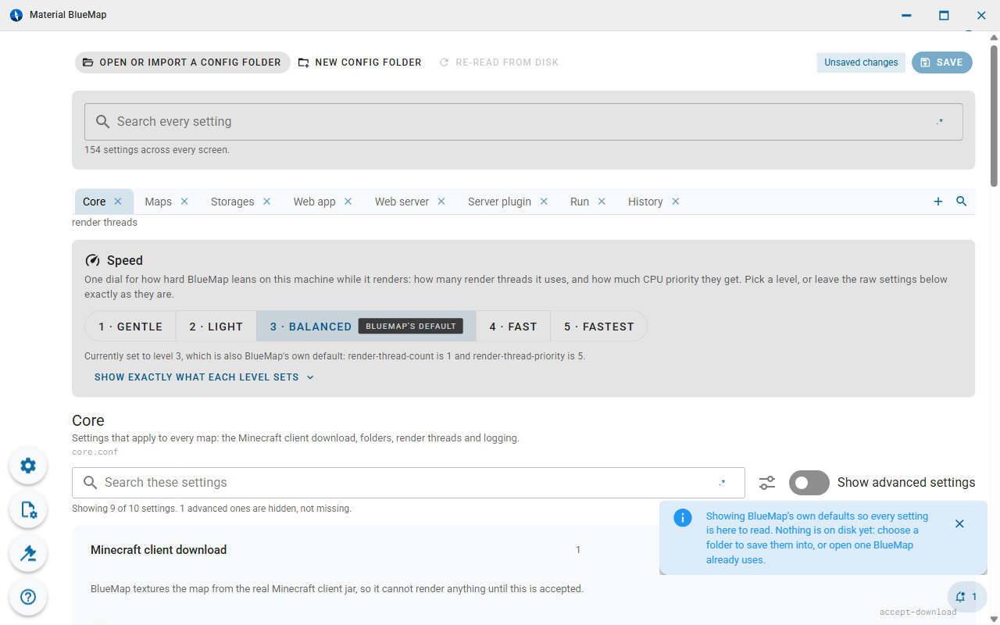

The notification corner reporting, without blocking anything, what the options editor loaded when it opened. Real Electron app. The map was rendered by upstream BlueMap's Java engine from a world this repository generated, and is served to the app over loopback by this repository's own map handler. What it proves is the viewer port, the embedded server and the reverse proxy. The TypeScript mesher in packages/engine rendered none of it. In this image, an opaque surface fills the window, so none of the map behind it is visible. The editor is showing BlueMap's own generated defaults, because the throwaway profile this run uses has no config folder on disk, and it says so in the notice across the top. Every setting, tab and control in the image is real, live and savable; what is absent is a folder read off this machine.

## config-screen

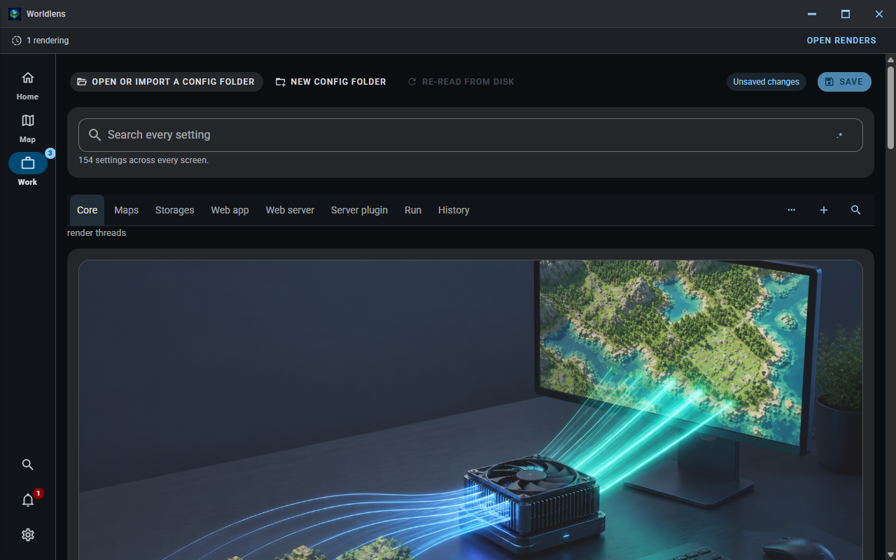

The options editor as it opens. Real Electron app. The map was rendered by upstream BlueMap's Java engine from a world this repository generated, and is served to the app over loopback by this repository's own map handler. What it proves is the viewer port, the embedded server and the reverse proxy. The TypeScript mesher in packages/engine rendered none of it. In this image, an opaque surface fills the window, so none of the map behind it is visible. The editor is showing BlueMap's own generated defaults, because the throwaway profile this run uses has no config folder on disk, and it says so in the notice across the top. Every setting, tab and control in the image is real, live and savable; what is absent is a folder read off this machine.

## config-tab-core

The options editor, the "Core" tab, with the settings that tab owns. Real Electron app. The map was rendered by upstream BlueMap's Java engine from a world this repository generated, and is served to the app over loopback by this repository's own map handler. What it proves is the viewer port, the embedded server and the reverse proxy. The TypeScript mesher in packages/engine rendered none of it. In this image, an opaque surface fills the window, so none of the map behind it is visible. The editor is showing BlueMap's own generated defaults, because the throwaway profile this run uses has no config folder on disk, and it says so in the notice across the top. Every setting, tab and control in the image is real, live and savable; what is absent is a folder read off this machine.

## config-tab-maps

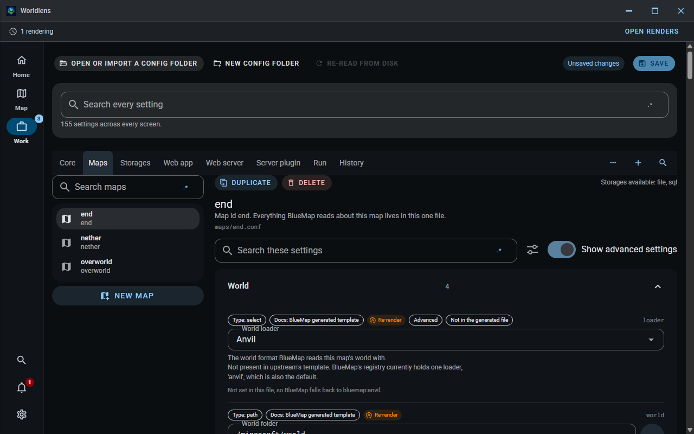

The options editor, the "Maps" tab, with the settings that tab owns. Real Electron app. The map was rendered by upstream BlueMap's Java engine from a world this repository generated, and is served to the app over loopback by this repository's own map handler. What it proves is the viewer port, the embedded server and the reverse proxy. The TypeScript mesher in packages/engine rendered none of it. In this image, an opaque surface fills the window, so none of the map behind it is visible. The editor is showing BlueMap's own generated defaults, because the throwaway profile this run uses has no config folder on disk, and it says so in the notice across the top. Every setting, tab and control in the image is real, live and savable; what is absent is a folder read off this machine.

## config-tab-storages

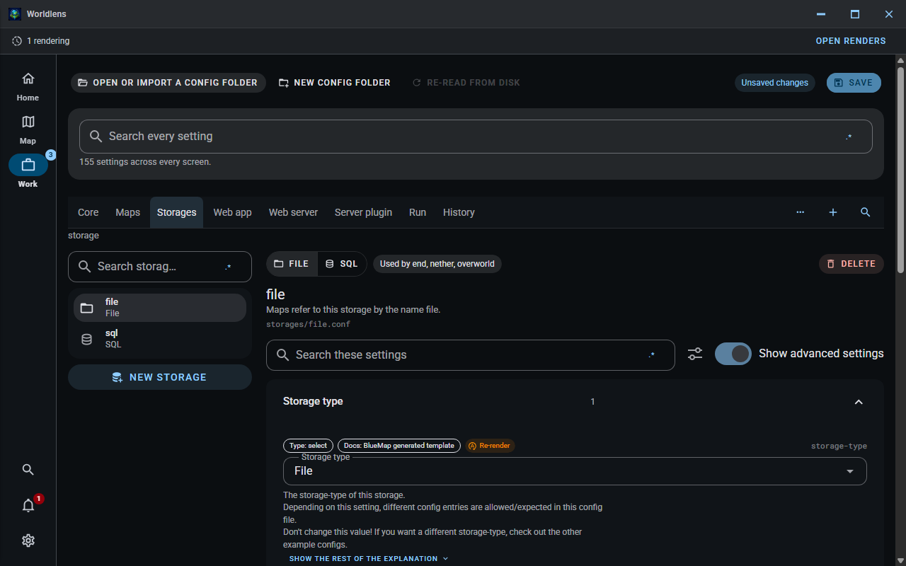

The options editor, the "Storages" tab, with the settings that tab owns. Real Electron app. The map was rendered by upstream BlueMap's Java engine from a world this repository generated, and is served to the app over loopback by this repository's own map handler. What it proves is the viewer port, the embedded server and the reverse proxy. The TypeScript mesher in packages/engine rendered none of it. In this image, an opaque surface fills the window, so none of the map behind it is visible. The editor is showing BlueMap's own generated defaults, because the throwaway profile this run uses has no config folder on disk, and it says so in the notice across the top. Every setting, tab and control in the image is real, live and savable; what is absent is a folder read off this machine.

## config-tab-web-app

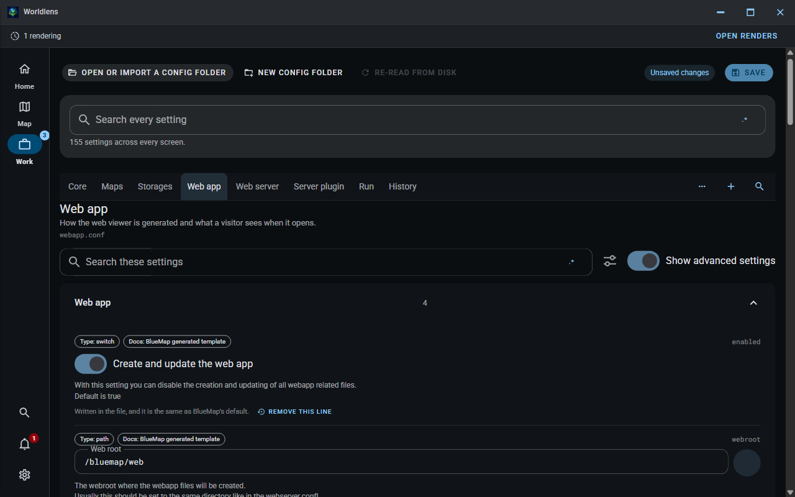

The options editor, the "Web app" tab, with the settings that tab owns. Real Electron app. The map was rendered by upstream BlueMap's Java engine from a world this repository generated, and is served to the app over loopback by this repository's own map handler. What it proves is the viewer port, the embedded server and the reverse proxy. The TypeScript mesher in packages/engine rendered none of it. In this image, an opaque surface fills the window, so none of the map behind it is visible. The editor is showing BlueMap's own generated defaults, because the throwaway profile this run uses has no config folder on disk, and it says so in the notice across the top. Every setting, tab and control in the image is real, live and savable; what is absent is a folder read off this machine.

## config-tab-web-server

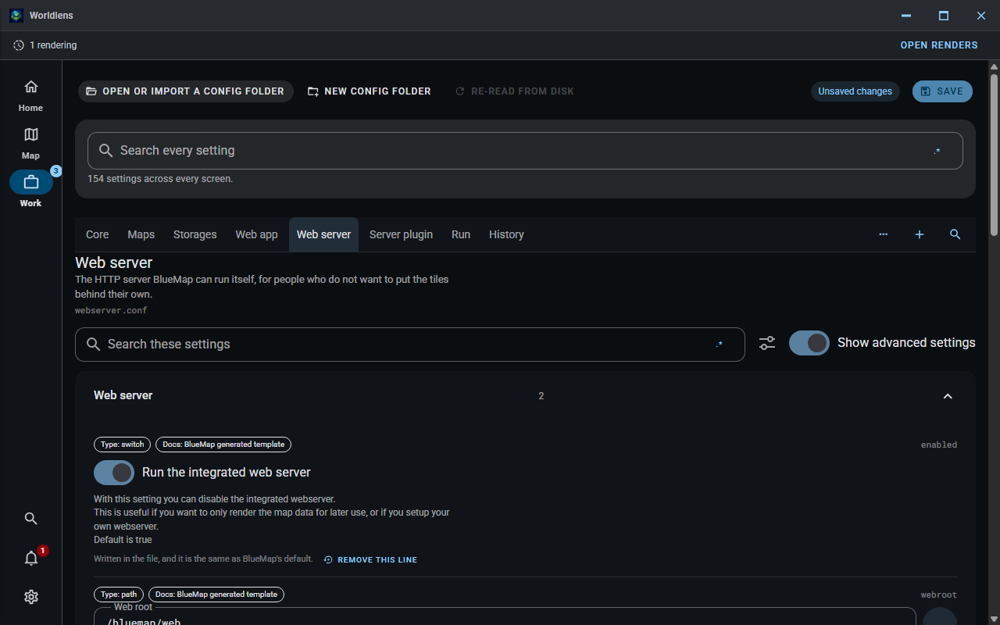

The options editor, the "Web server" tab, with the settings that tab owns. Real Electron app. The map was rendered by upstream BlueMap's Java engine from a world this repository generated, and is served to the app over loopback by this repository's own map handler. What it proves is the viewer port, the embedded server and the reverse proxy. The TypeScript mesher in packages/engine rendered none of it. In this image, an opaque surface fills the window, so none of the map behind it is visible. The editor is showing BlueMap's own generated defaults, because the throwaway profile this run uses has no config folder on disk, and it says so in the notice across the top. Every setting, tab and control in the image is real, live and savable; what is absent is a folder read off this machine.

## config-tab-server-plugin

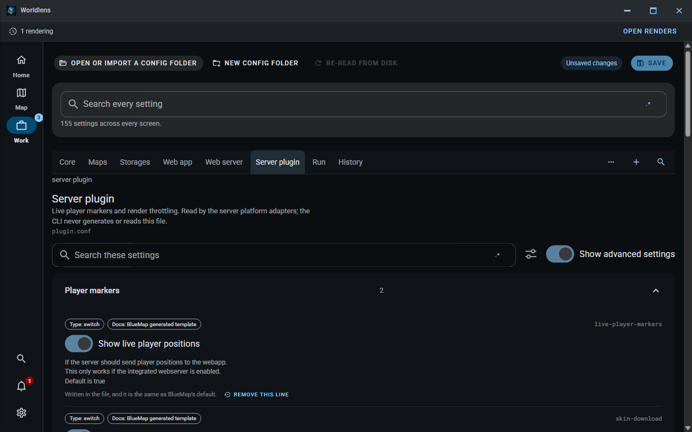

The options editor, the "Server plugin" tab, with the settings that tab owns. Real Electron app. The map was rendered by upstream BlueMap's Java engine from a world this repository generated, and is served to the app over loopback by this repository's own map handler. What it proves is the viewer port, the embedded server and the reverse proxy. The TypeScript mesher in packages/engine rendered none of it. In this image, an opaque surface fills the window, so none of the map behind it is visible. The editor is showing BlueMap's own generated defaults, because the throwaway profile this run uses has no config folder on disk, and it says so in the notice across the top. Every setting, tab and control in the image is real, live and savable; what is absent is a folder read off this machine.

## config-tab-run

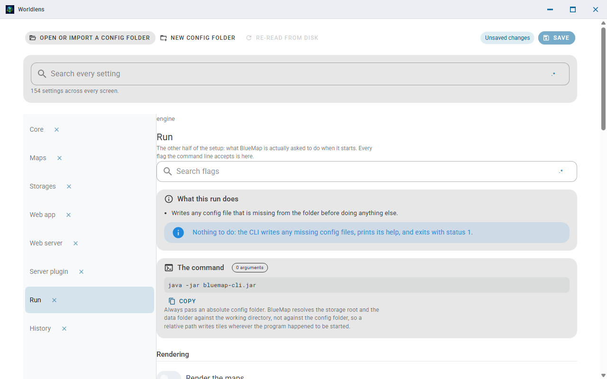

The options editor, the "Run" tab, with the settings that tab owns. Real Electron app. The map was rendered by upstream BlueMap's Java engine from a world this repository generated, and is served to the app over loopback by this repository's own map handler. What it proves is the viewer port, the embedded server and the reverse proxy. The TypeScript mesher in packages/engine rendered none of it. In this image, an opaque surface fills the window, so none of the map behind it is visible. The editor is showing BlueMap's own generated defaults, because the throwaway profile this run uses has no config folder on disk, and it says so in the notice across the top. Every setting, tab and control in the image is real, live and savable; what is absent is a folder read off this machine.

## config-tab-history

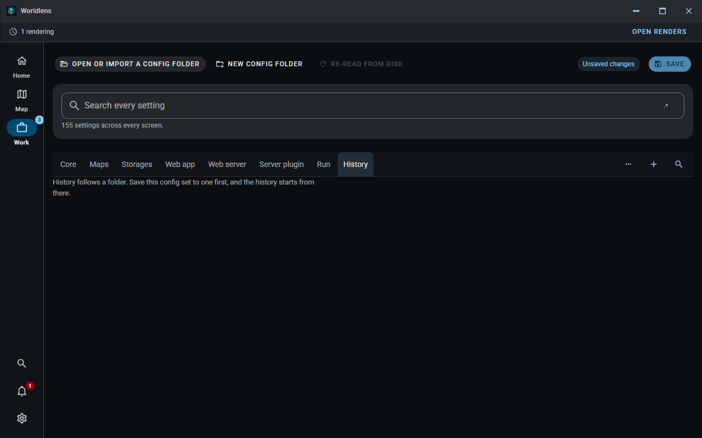

The options editor, the "History" tab, with the settings that tab owns. Real Electron app. The map was rendered by upstream BlueMap's Java engine from a world this repository generated, and is served to the app over loopback by this repository's own map handler. What it proves is the viewer port, the embedded server and the reverse proxy. The TypeScript mesher in packages/engine rendered none of it. In this image, an opaque surface fills the window, so none of the map behind it is visible. The editor is showing BlueMap's own generated defaults, because the throwaway profile this run uses has no config folder on disk, and it says so in the notice across the top. Every setting, tab and control in the image is real, live and savable; what is absent is a folder read off this machine.

## config-search

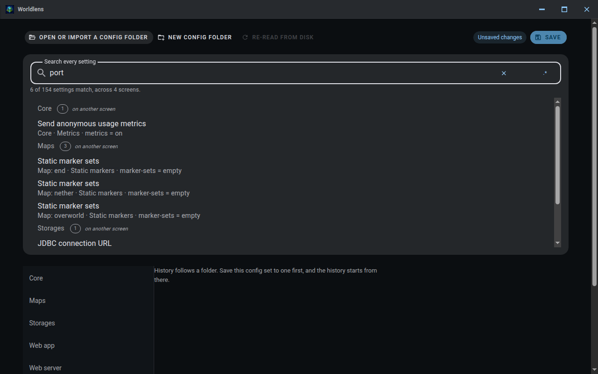

The options editor's search, which reaches every setting on all of the tabs at once and says which tab each result lives on. Real Electron app. The map was rendered by upstream BlueMap's Java engine from a world this repository generated, and is served to the app over loopback by this repository's own map handler. What it proves is the viewer port, the embedded server and the reverse proxy. The TypeScript mesher in packages/engine rendered none of it. In this image, an opaque surface fills the window, so none of the map behind it is visible. The editor is showing BlueMap's own generated defaults, because the throwaway profile this run uses has no config folder on disk, and it says so in the notice across the top. Every setting, tab and control in the image is real, live and savable; what is absent is a folder read off this machine.

## config-regex-builder

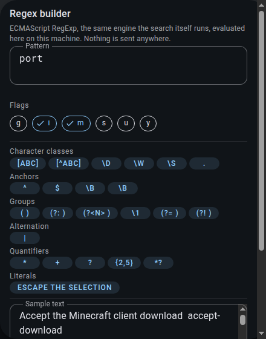

The regex builder anchored to the options editor's search bar. Real Electron app. The map was rendered by upstream BlueMap's Java engine from a world this repository generated, and is served to the app over loopback by this repository's own map handler. What it proves is the viewer port, the embedded server and the reverse proxy. The TypeScript mesher in packages/engine rendered none of it. This image is cropped to the regex builder rather than showing the whole window.

## config-delete-gate

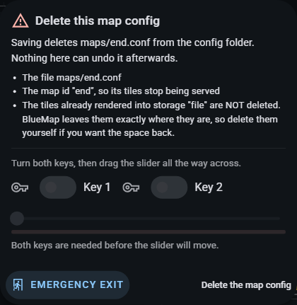

The super confirmation that guards deleting a map's configuration: two keys, then a full-travel slider, with an emergency exit that is always available. Real Electron app. The map was rendered by upstream BlueMap's Java engine from a world this repository generated, and is served to the app over loopback by this repository's own map handler. What it proves is the viewer port, the embedded server and the reverse proxy. The TypeScript mesher in packages/engine rendered none of it. This image is cropped to the confirmation popover rather than showing the whole window.

## config-history

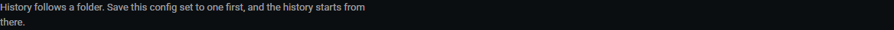

The config folder's version-history tab, including its honest empty state when this throwaway profile has no folder attached. Real Electron app. The map was rendered by upstream BlueMap's Java engine from a world this repository generated, and is served to the app over loopback by this repository's own map handler. What it proves is the viewer port, the embedded server and the reverse proxy. The TypeScript mesher in packages/engine rendered none of it. This image is cropped to the version-history panel rather than showing the whole window.

## projects-screen

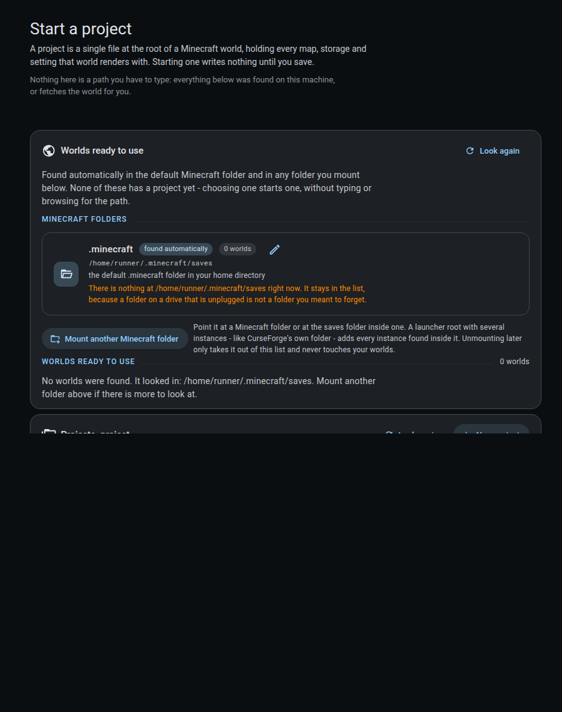

The Projects screen, showing the real empty state and the path into a new render project. Real Electron app. The map was rendered by upstream BlueMap's Java engine from a world this repository generated, and is served to the app over loopback by this repository's own map handler. What it proves is the viewer port, the embedded server and the reverse proxy. The TypeScript mesher in packages/engine rendered none of it. This image is cropped to the Projects screen rather than showing the whole window.

## ci-render-screen

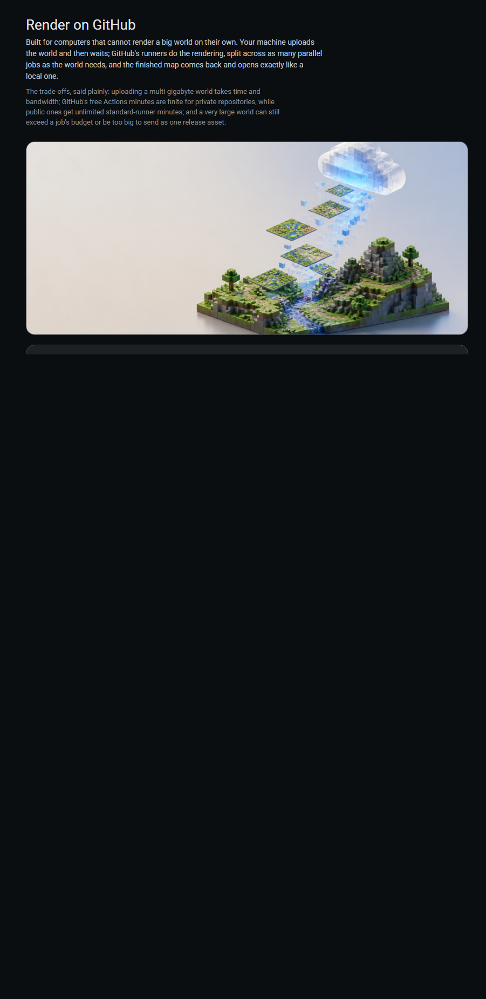

The CI-render screen, with its honest repository fields and the preflight route that refuses before uploading anything. Real Electron app. The map was rendered by upstream BlueMap's Java engine from a world this repository generated, and is served to the app over loopback by this repository's own map handler. What it proves is the viewer port, the embedded server and the reverse proxy. The TypeScript mesher in packages/engine rendered none of it. This image is cropped to the CI-render screen rather than showing the whole window.

## pages-publishing-screen

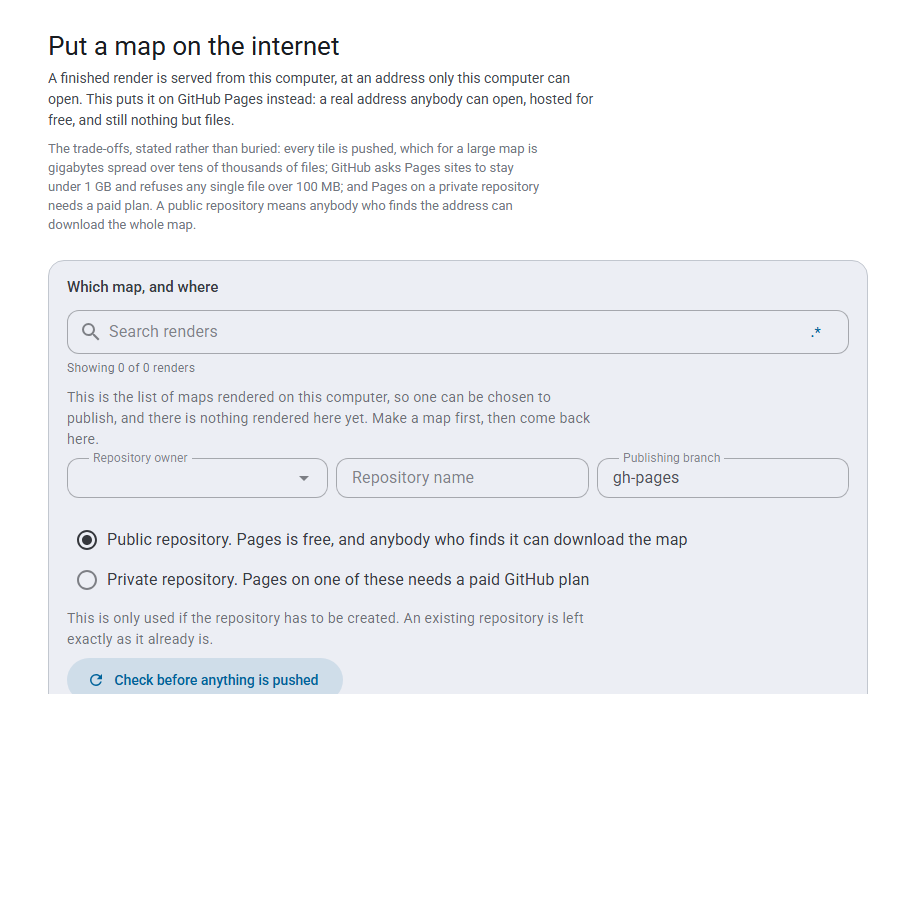

The Pages publishing screen: the searchable render list, the repository fields, and the check that reports what publishing would push before anything is pushed. Real Electron app. The map was rendered by upstream BlueMap's Java engine from a world this repository generated, and is served to the app over loopback by this repository's own map handler. What it proves is the viewer port, the embedded server and the reverse proxy. The TypeScript mesher in packages/engine rendered none of it. This image is cropped to the Pages publishing screen rather than showing the whole window.

## eula-viewer

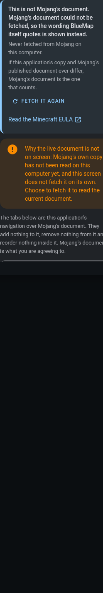

The EULA viewer embedded in Settings, with the bundled or cached licence copy, its provenance and its searchable section tabs. Real Electron app. The map was rendered by upstream BlueMap's Java engine from a world this repository generated, and is served to the app over loopback by this repository's own map handler. What it proves is the viewer port, the embedded server and the reverse proxy. The TypeScript mesher in packages/engine rendered none of it. This image is cropped to the EULA viewer rather than showing the whole window.

## notifications-corner

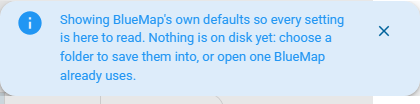

The notification corner in the bottom right: a message that reports without blocking anything, and beside it the button that opens the history of everything the application has said. Real Electron app. The map was rendered by upstream BlueMap's Java engine from a world this repository generated, and is served to the app over loopback by this repository's own map handler. What it proves is the viewer port, the embedded server and the reverse proxy. The TypeScript mesher in packages/engine rendered none of it. This image is cropped to the notification corner rather than showing the whole window.

## notifications-history

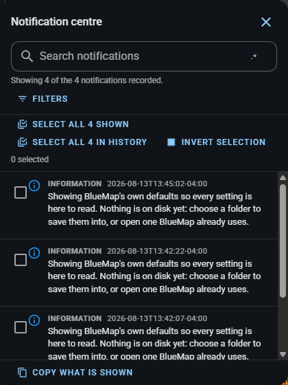

The notification centre, so a message that has already faded away is still readable, searchable and filterable by level. Real Electron app. The map was rendered by upstream BlueMap's Java engine from a world this repository generated, and is served to the app over loopback by this repository's own map handler. What it proves is the viewer port, the embedded server and the reverse proxy. The TypeScript mesher in packages/engine rendered none of it. This image is cropped to the notification centre rather than showing the whole window.

## palette

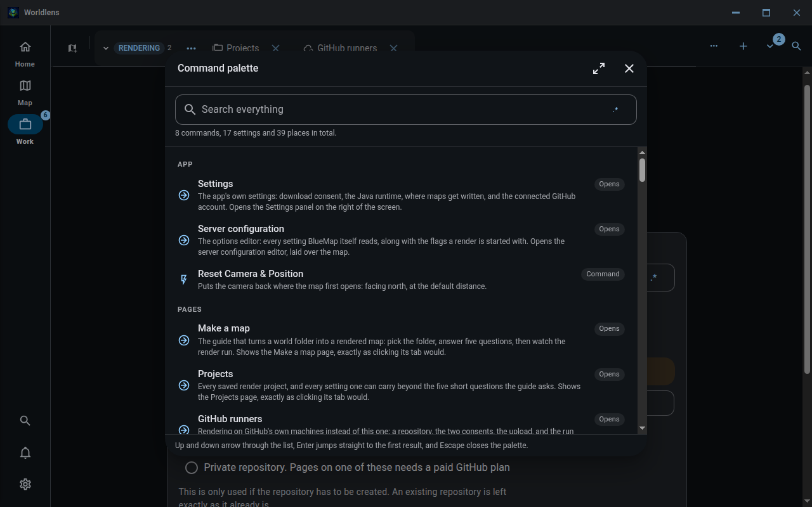

The command palette, opened with Ctrl+Shift+F: every command, setting and destination the application has, in one searchable list. Real Electron app. The map was rendered by upstream BlueMap's Java engine from a world this repository generated, and is served to the app over loopback by this repository's own map handler. What it proves is the viewer port, the embedded server and the reverse proxy. The TypeScript mesher in packages/engine rendered none of it. In this image, an opaque surface fills the window, so none of the map behind it is visible.

## palette-search

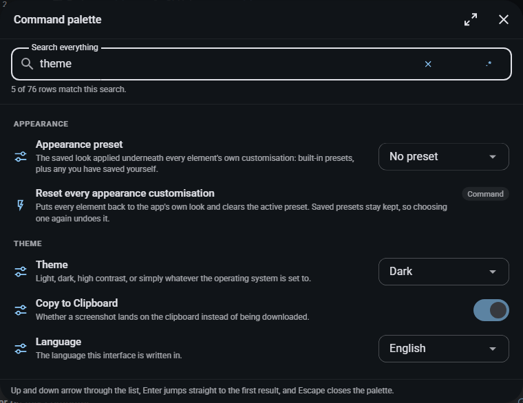

The command palette filtered by a search, with a setting row that carries its own live control - changing it here changes the real setting, the same way changing it on its own page would. Real Electron app. The map was rendered by upstream BlueMap's Java engine from a world this repository generated, and is served to the app over loopback by this repository's own map handler. What it proves is the viewer port, the embedded server and the reverse proxy. The TypeScript mesher in packages/engine rendered none of it. This image is cropped to the command palette rather than showing the whole window.

## tab-strip

The browser-style tab strip: the shell's own pages, the new-tab menu, the overflow control that appears only once something stops fitting, and the tab finder's own magnifier. Real Electron app. The map was rendered by upstream BlueMap's Java engine from a world this repository generated, and is served to the app over loopback by this repository's own map handler. What it proves is the viewer port, the embedded server and the reverse proxy. The TypeScript mesher in packages/engine rendered none of it. This image is cropped to the tab strip rather than showing the whole window.

## tab-context-menu

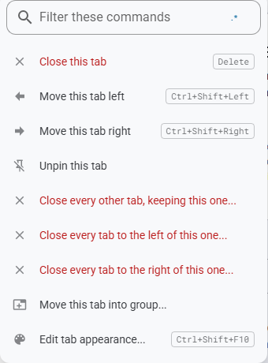

Right-clicking a tab: its own management commands, with the keyboard-reachable filter every context menu in this application carries and the working shortcut printed beside each item that has one. Real Electron app. The map was rendered by upstream BlueMap's Java engine from a world this repository generated, and is served to the app over loopback by this repository's own map handler. What it proves is the viewer port, the embedded server and the reverse proxy. The TypeScript mesher in packages/engine rendered none of it. This image is cropped to the tab's context menu rather than showing the whole window.

## tab-finder

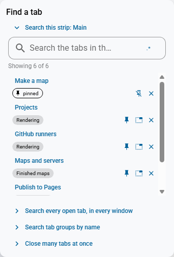

The tab finder: search this strip, search every open tab in every window, search groups by name, and both text bulk closes, each with its own anchored regex builder. Real Electron app. The map was rendered by upstream BlueMap's Java engine from a world this repository generated, and is served to the app over loopback by this repository's own map handler. What it proves is the viewer port, the embedded server and the reverse proxy. The TypeScript mesher in packages/engine rendered none of it. This image is cropped to the tab finder rather than showing the whole window.

## tab-bulk-close-preview

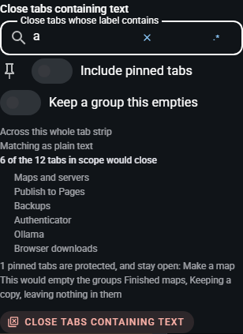

Close tabs containing text, previewing exactly which tabs the pattern matches and what closing them would do, before anything closes. Real Electron app. The map was rendered by upstream BlueMap's Java engine from a world this repository generated, and is served to the app over loopback by this repository's own map handler. What it proves is the viewer port, the embedded server and the reverse proxy. The TypeScript mesher in packages/engine rendered none of it. This image is cropped to the bulk-close panel rather than showing the whole window.

## appearance-context-menu

A tab's own context menu: its management commands, then "Edit tab appearance..." with its working Ctrl+Shift+F10 shortcut printed beside it, and the menu's own searchable filter at the top. Real Electron app. The map was rendered by upstream BlueMap's Java engine from a world this repository generated, and is served to the app over loopback by this repository's own map handler. What it proves is the viewer port, the embedded server and the reverse proxy. The TypeScript mesher in packages/engine rendered none of it. This image is cropped to the tab's context menu rather than showing the whole window.

## appearance-typography

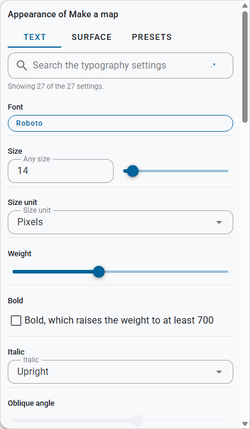

The appearance editor's Text tab: every installed and bundled font with its own live preview, size, weight, style and the rest of the Word-depth typography controls, editing this tab's own label live. Real Electron app. The map was rendered by upstream BlueMap's Java engine from a world this repository generated, and is served to the app over loopback by this repository's own map handler. What it proves is the viewer port, the embedded server and the reverse proxy. The TypeScript mesher in packages/engine rendered none of it. This image is cropped to the appearance editor rather than showing the whole window.

## appearance-surface

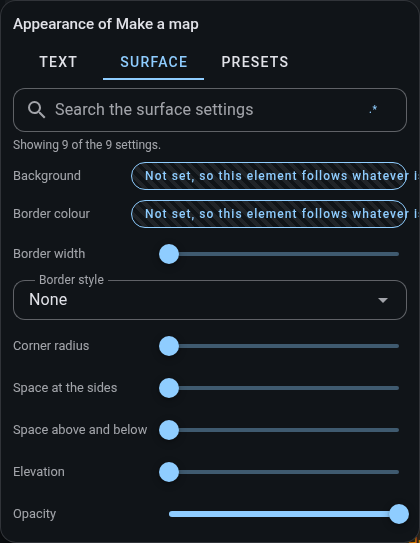

The appearance editor's Surface tab: background and border colour, border style, radius, spacing, shadow and opacity for this tab, each with a reset of its own. Real Electron app. The map was rendered by upstream BlueMap's Java engine from a world this repository generated, and is served to the app over loopback by this repository's own map handler. What it proves is the viewer port, the embedded server and the reverse proxy. The TypeScript mesher in packages/engine rendered none of it. This image is cropped to the appearance editor rather than showing the whole window.

## infinite-colour-picker

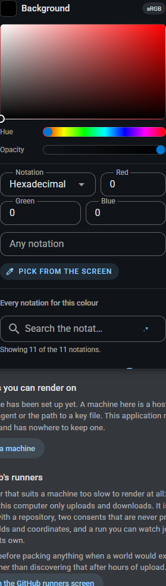

The infinite colour picker: a continuous field rather than a swatch grid, translated across named colours, hex, RGB, HSL, HSV, HWB, CIELAB/LCH, OKLab/OKLCH and CMYK, with a contrast readout. Real Electron app. The map was rendered by upstream BlueMap's Java engine from a world this repository generated, and is served to the app over loopback by this repository's own map handler. What it proves is the viewer port, the embedded server and the reverse proxy. The TypeScript mesher in packages/engine rendered none of it. This image is cropped to the infinite colour picker rather than showing the whole window.

## changelog-viewer

The changelog viewer, folded inside the Info page: every released version, its date filter, its own search wired to the regex builder, and the commit each entry links to. Real Electron app. The map was rendered by upstream BlueMap's Java engine from a world this repository generated, and is served to the app over loopback by this repository's own map handler. What it proves is the viewer port, the embedded server and the reverse proxy. The TypeScript mesher in packages/engine rendered none of it. This image is cropped to the changelog fold in the Info page rather than showing the whole window.

## wizard-1-world

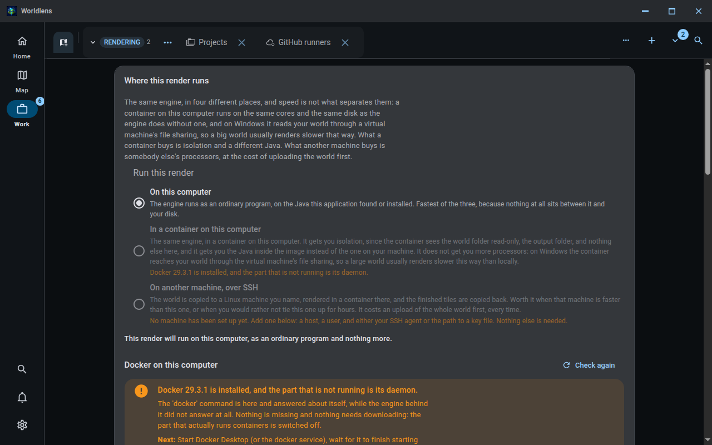

The make-a-map wizard on its first step, asking for the world folder, with its five steps listed across the top. Real Electron app. The map was rendered by upstream BlueMap's Java engine from a world this repository generated, and is served to the app over loopback by this repository's own map handler. What it proves is the viewer port, the embedded server and the reverse proxy. The TypeScript mesher in packages/engine rendered none of it. In this image, no map is loaded, so the application is showing the wizard for making one.

## wizard-ssh-world-source

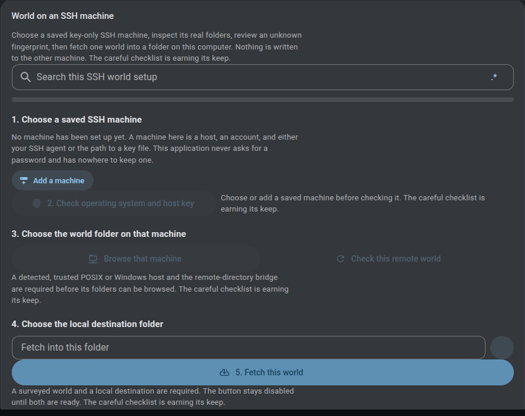

The SSH world-source checklist inside the first wizard step: saved key-only machines, explicit host-key review, remote-world inspection, and a local fetch destination. Real Electron app. The map was rendered by upstream BlueMap's Java engine from a world this repository generated, and is served to the app over loopback by this repository's own map handler. What it proves is the viewer port, the embedded server and the reverse proxy. The TypeScript mesher in packages/engine rendered none of it. This image is cropped to the SSH world-source checklist rather than showing the whole window.

## wizard-1-world-read

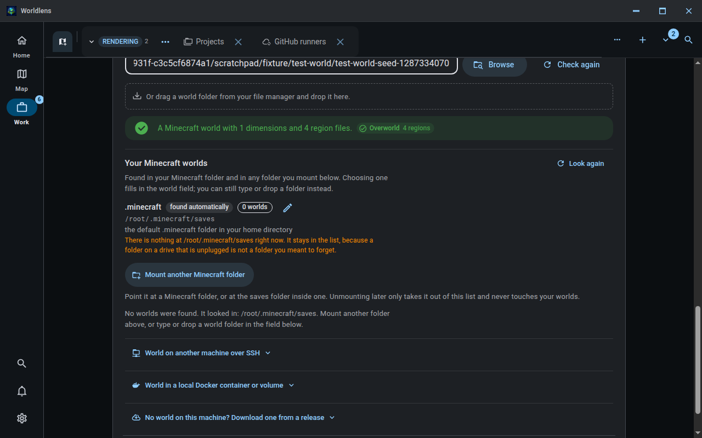

The wizard's first step after the world folder has been read: it names the dimensions it found and how many region files each of them holds. Real Electron app. The map was rendered by upstream BlueMap's Java engine from a world this repository generated, and is served to the app over loopback by this repository's own map handler. What it proves is the viewer port, the embedded server and the reverse proxy. The TypeScript mesher in packages/engine rendered none of it. In this image, no map is loaded, so the application is showing the wizard for making one.

## wizard-2-name-and-dimension

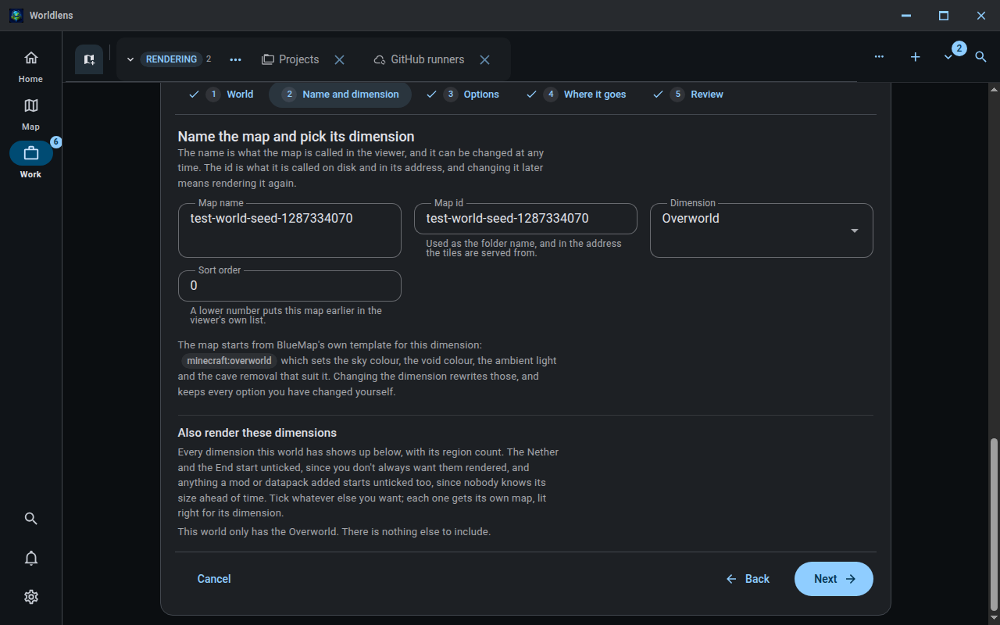

The make-a-map wizard on its "Name and dimension" step. Real Electron app. The map was rendered by upstream BlueMap's Java engine from a world this repository generated, and is served to the app over loopback by this repository's own map handler. What it proves is the viewer port, the embedded server and the reverse proxy. The TypeScript mesher in packages/engine rendered none of it. In this image, no map is loaded, so the application is showing the wizard for making one.

## wizard-3-options

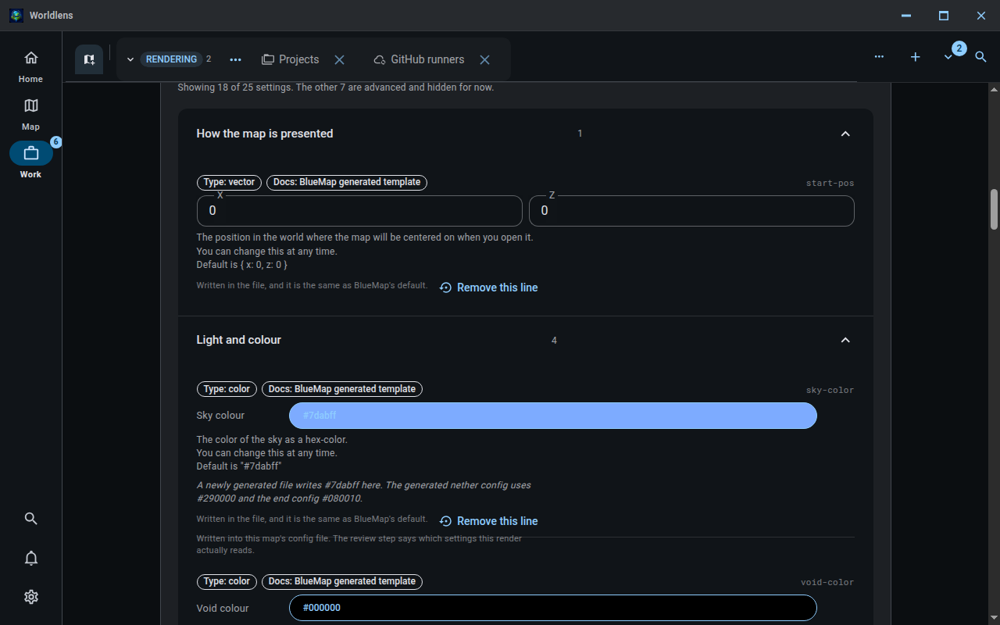

The make-a-map wizard on its "Options" step. Real Electron app. The map was rendered by upstream BlueMap's Java engine from a world this repository generated, and is served to the app over loopback by this repository's own map handler. What it proves is the viewer port, the embedded server and the reverse proxy. The TypeScript mesher in packages/engine rendered none of it. In this image, no map is loaded, so the application is showing the wizard for making one.

## wizard-4-where-it-goes

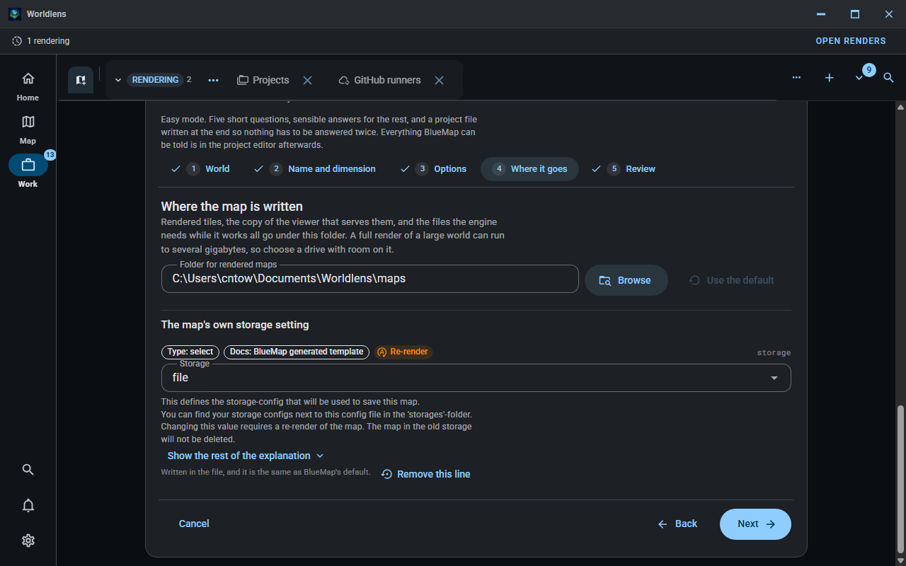

The make-a-map wizard on its "Where it goes" step. Real Electron app. The map was rendered by upstream BlueMap's Java engine from a world this repository generated, and is served to the app over loopback by this repository's own map handler. What it proves is the viewer port, the embedded server and the reverse proxy. The TypeScript mesher in packages/engine rendered none of it. In this image, no map is loaded, so the application is showing the wizard for making one.

## wizard-5-review

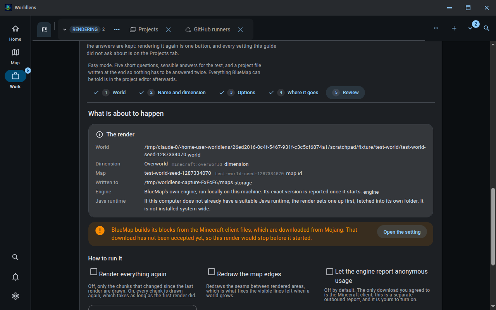

The make-a-map wizard on its "Review" step. Real Electron app. The map was rendered by upstream BlueMap's Java engine from a world this repository generated, and is served to the app over loopback by this repository's own map handler. What it proves is the viewer port, the embedded server and the reverse proxy. The TypeScript mesher in packages/engine rendered none of it. In this image, no map is loaded, so the application is showing the wizard for making one.

## wizard-release-downloads

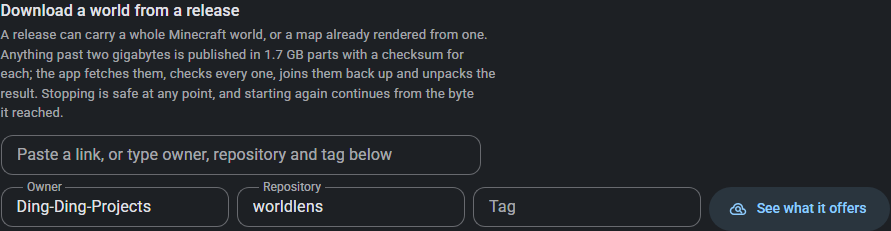

The release downloads panel, which offers to fetch a world from a GitHub release for somebody with no Minecraft save on this machine. Real Electron app. The map was rendered by upstream BlueMap's Java engine from a world this repository generated, and is served to the app over loopback by this repository's own map handler. What it proves is the viewer port, the embedded server and the reverse proxy. The TypeScript mesher in packages/engine rendered none of it. This image is cropped to the release downloads panel rather than showing the whole window.

## Not captured

Nothing was substituted for these. They are listed so the gap is visible.

- **Marker search and sort controls**: the map this run captured carries no markers, so the marker menu has no marker section and its search and sort controls are not on screen to photograph
- **GitHub account, signed in**: signing in needs a real GitHub account and a real device-flow round trip to github.com, and the offline guard refuses every request that is not loopback; the signed-out state of the account section is real and is the one captured
- **Options editor save plan**: the Save control is disabled in this state, and its tooltip says why; the dialog that lists the files a save would write therefore has no door to open through, and nothing was substituted for it
- **Render console**: the harness could not open it in this run: locator.waitFor: Timeout 3000ms exceeded.
- **Wizard, Docker world source**: the harness could not open it in this run: expect(received).toBe(expected) // Object.is equality
- **Release asset list and download progress**: listing a release's assets and downloading one both need real traffic to github.com, which the offline guard refuses; the panel is captured in the state it is in before anything has been asked for
- **Render progress panel**: it only exists while a render is actually running, which needs a Java runtime, an accepted Mojang download consent and minutes of work; this run declined that consent
- **Interrupted renders**: it only appears when a previous render was interrupted and left a session behind, and the throwaway profile this run used has never started one
